# Раунд 1 — «Терминал с видами»

> Направление выбрал хозяин после раунда 0 (`DECISIONS.md` 0.9), поэтому вместо
> трёх концепций здесь одна, но глубже. Вход: `docs/ANSWERS-R0.md` и снимки
> `docs/current-shots/`. Дата: 2026-09-24.
>
> **Открыть:** двойной клик по `index.html`. Сети и сборки нет, шрифты и
> картинки берутся из `assets/`.

## Содержание

1. [Коротко](#1-коротко)
2. [Снимки](#2-снимки)
3. [Информационная архитектура](#3-информационная-архитектура)
4. [Как пользоваться прототипом](#4-как-пользоваться-прототипом)
5. [Решения и откуда они](#5-решения-и-откуда-они)
6. [Компоненты — Qt: как собрать](#6-компоненты--qt-как-собрать)
7. [Что потребует правок в коде FractalOS](#7-что-потребует-правок-в-коде-fractalos)
8. [Проверки перед сдачей](#8-проверки-перед-сдачей)
9. [Открытые вопросы](#9-открытые-вопросы)
10. [Что дальше: раунд 2](#10-что-дальше-раунд-2)

---

## 1. Коротко

- **Одно окно — четыре вида**, переключение `Ctrl+1…4`:
  «Разговор», «Состав», «Журнал», «Дифф».
  Рельса справа больше нет. Всё, что в нём было, переехало в строку закона и в вид «Состав».
- **Строка закона** под заголовком — ответ на приоритет №1. Слева общее
  состояние: «Всё работает» или самое серьёзное отклонение. Дальше — рот, мозг,
  руки, память, грант и замок, у каждого значение словом. Любой сегмент ведёт в
  «Состав» к этой части.
- **Лента подписана ролями.** В левом гуттере стоят штамп роли, провайдер и время:
  хозяин, рот, мозг, руки, окно. Бриф мозга — сворачиваемый блок. Найм рук —
  **один объект** с этапами «бриф → работа → расписка → дифф» и кнопкой
  «Проверить дифф».
- **Под полем видно, куда уйдёт Enter** — ещё до отправки: в разговор с ртом,
  в найм через бриф мозга, в очередь или в отказ «руки выключены». Это `ghost`
  из `guide.preview`, только всегда на виду и по-русски (§5.3).
- **«Состав и здоровье»** (`Ctrl+2`) — карта из 12 частей по мотивам LabCanvas,
  но у каждой части есть живое состояние. Справа — карточка выбранной части:
  «может / не может», данные, действия, последние события. Под картой — лента
  событий системы: сюда наконец попадает `set_note`.
- **Грант — отдельное решение хозяина.** Золотой блок в ленте: кто просит, куда
  пишет, зачем. Пока окно открыто, строка закона показывает срок.
- **Палитра `Ctrl+K`**: виды, проекты (`Ctrl+P`), роли, грант, сессия,
  настройки окна. Всё делается с клавиатуры.
- **На вашем 2560×1440** окно не пустеет: `Ctrl+\` делит его на «Разговор» и
  «Состав» бок о бок.

---

## 2. Снимки

Все снимки сделаны `tools/shots.mjs` в 1440×900 и 1920×1080; кадр с разделением — в 2560×1440.
На снимках шрифт Open Sans заменяет Segoe UI (см. `assets/fonts/README.md`).

| # | Что | 1440×900 | 1920×1080 |
|---|---|---|---|
| 01 | Разговор: найм закончен, дифф ждёт | 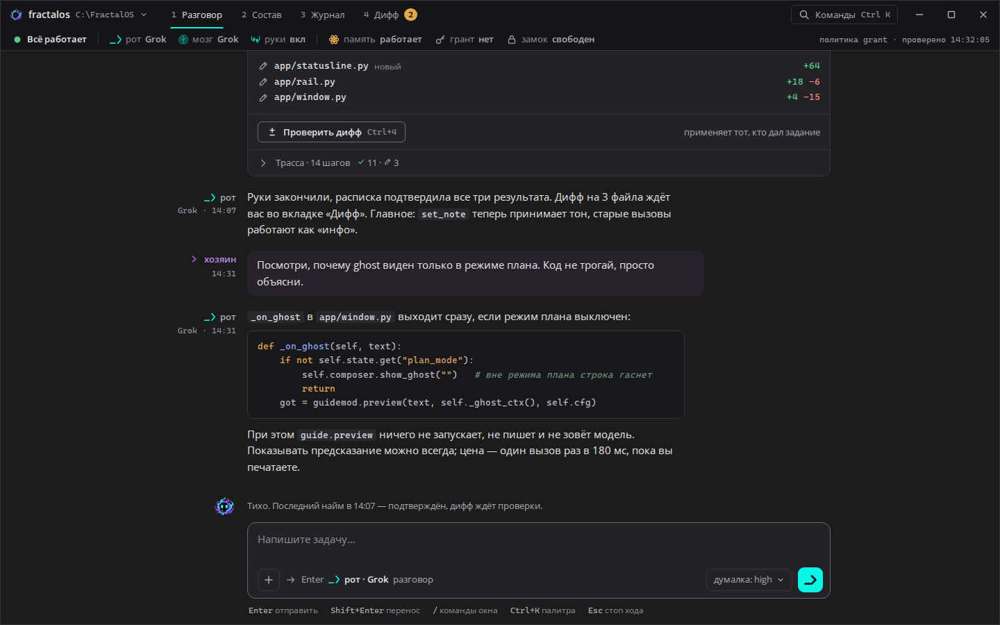 | 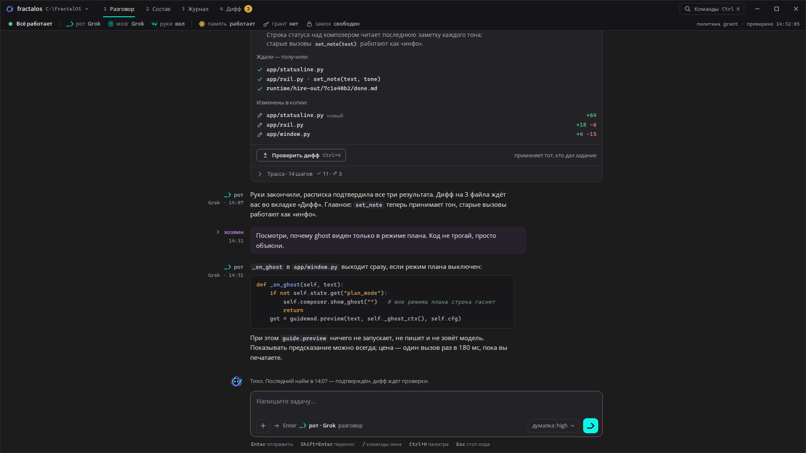 |
| 02 | Идёт найм: замок у рук, маскот в работе, Enter — в очередь | 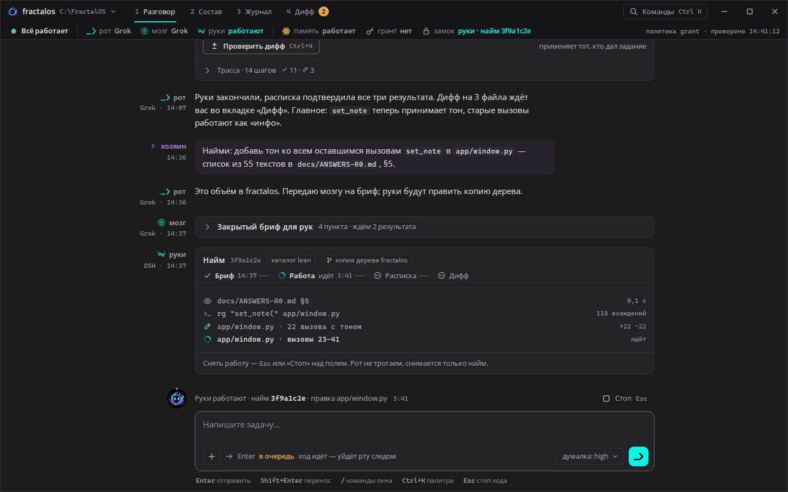 | 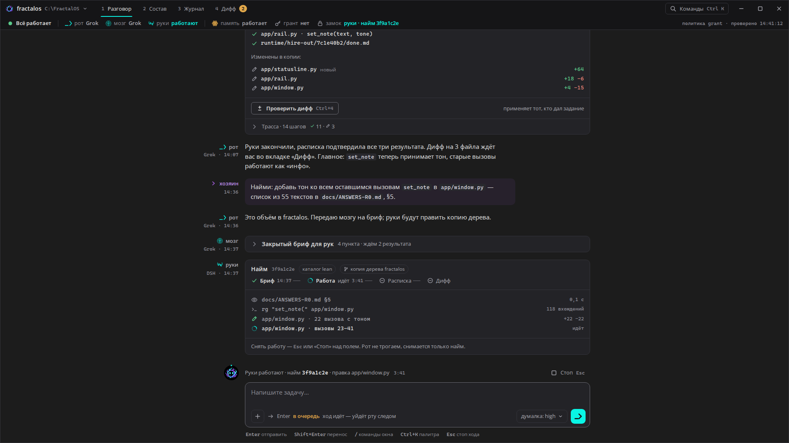 |
| 03 | Руки просят грант | 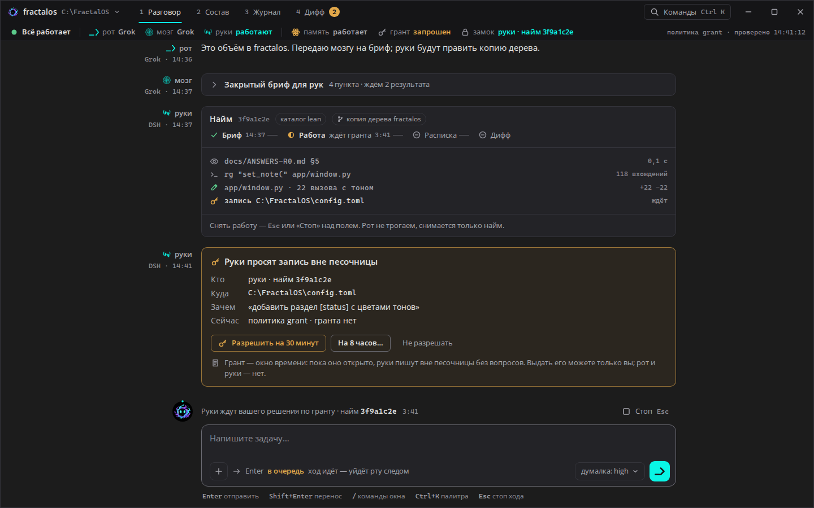 | 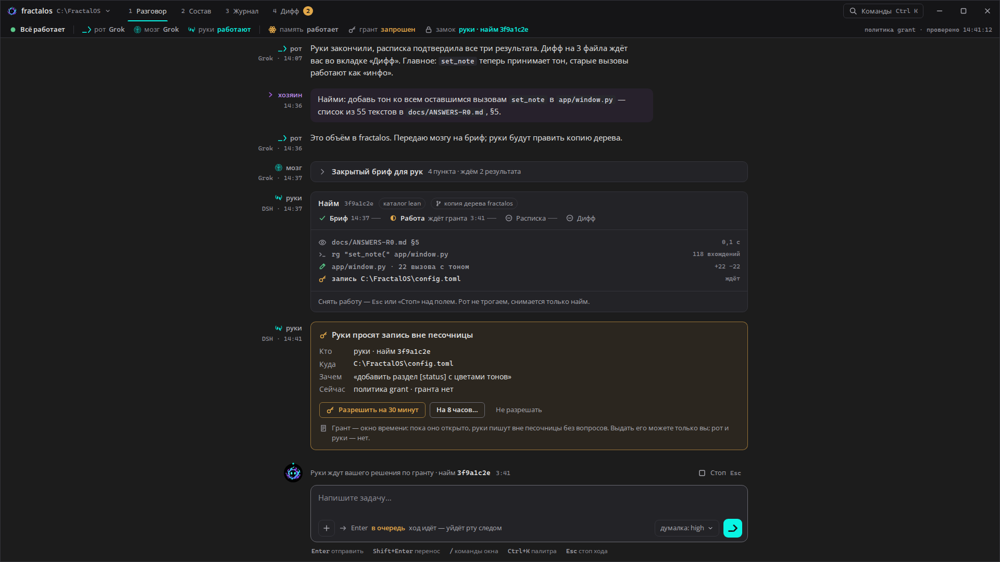 |
| 04 | Оговорки: мозг на запасном, память лежит, руки выключены; Enter → отказ | 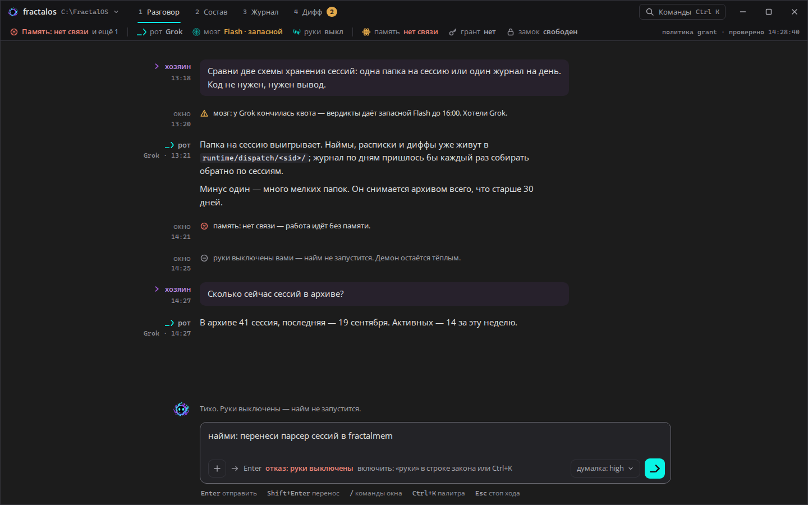 | 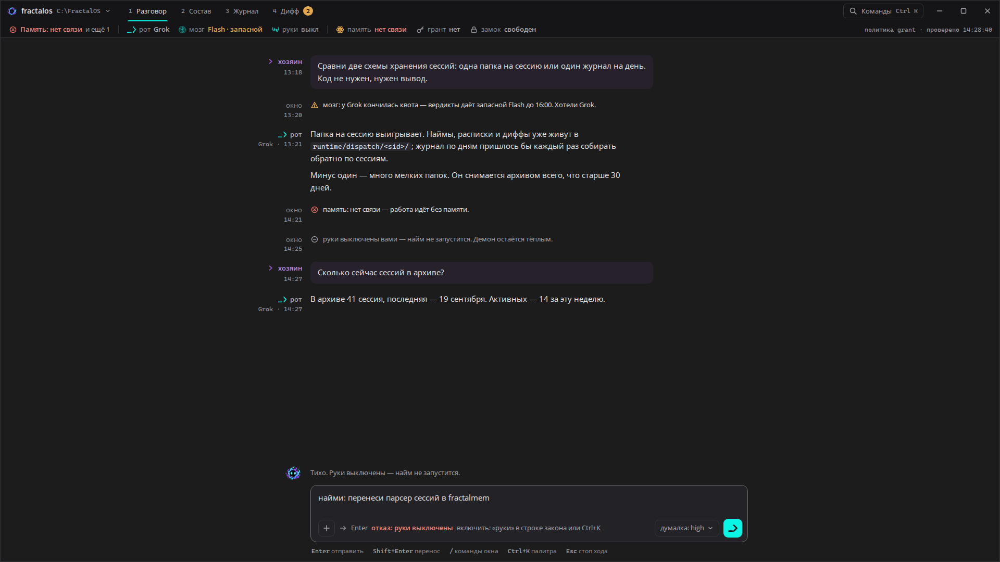 |
| 05 | Состав: всё работает, выбраны руки | 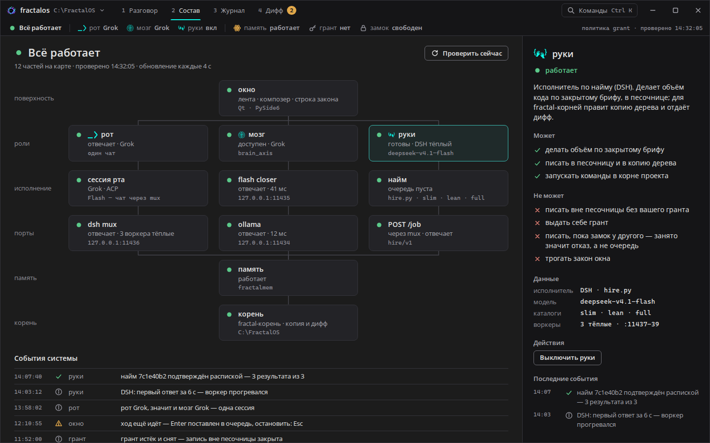 | 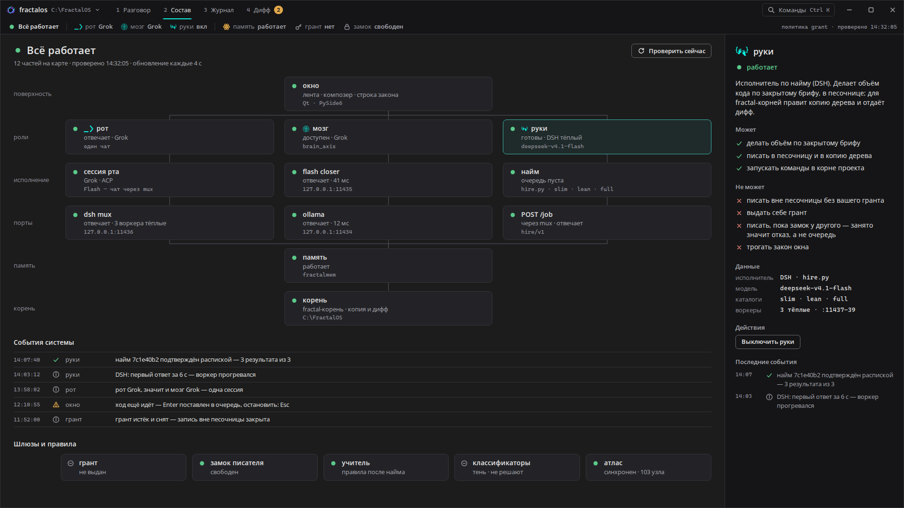 |
| 06 | Состав: память лежит, мозг с оговоркой | 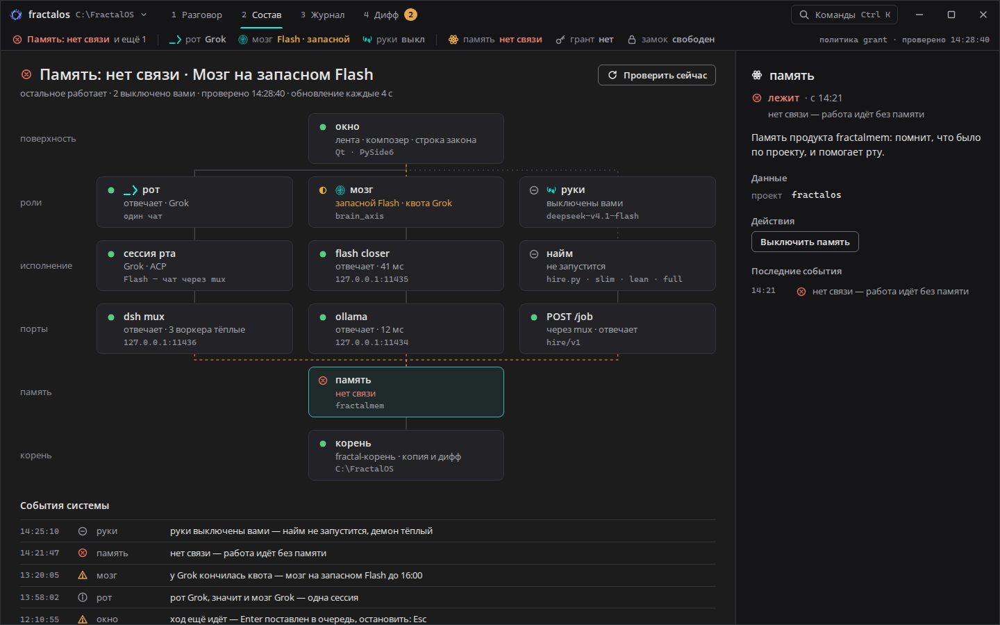 | 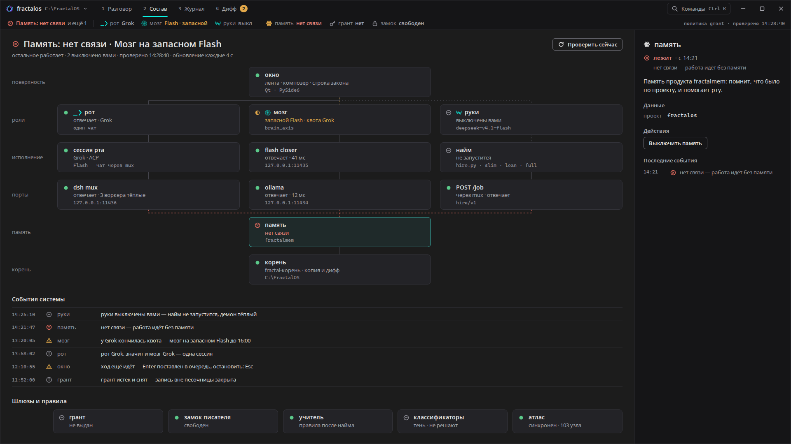 |
| 07 | Палитра команд | 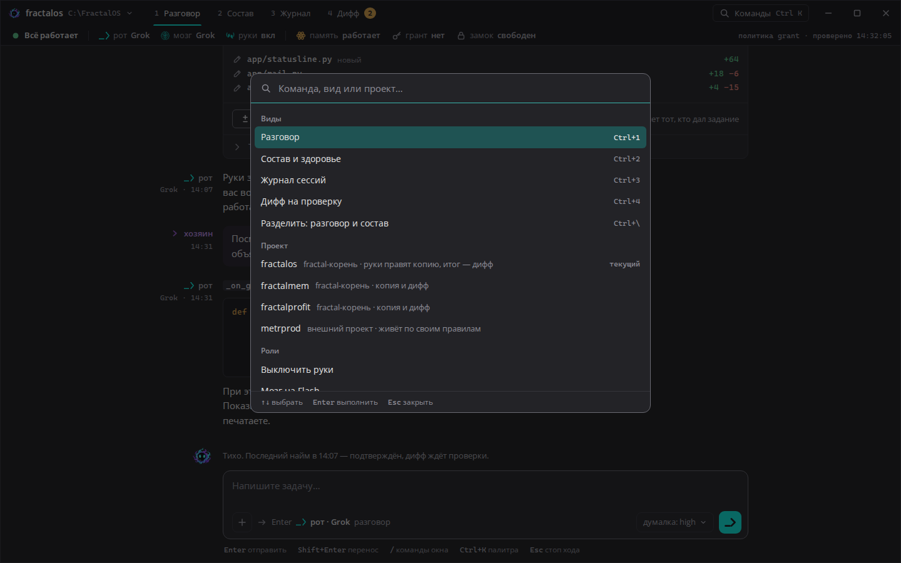 | 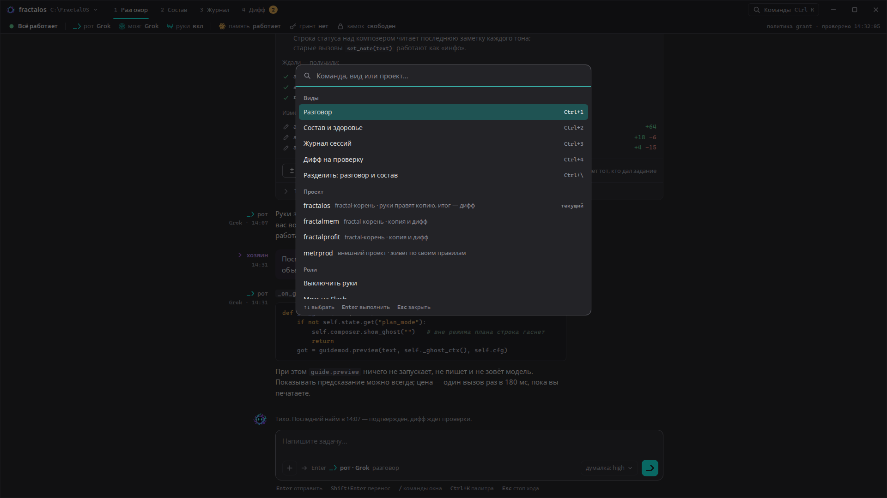 |
| 08 | 2560×1440: разговор и состав рядом | 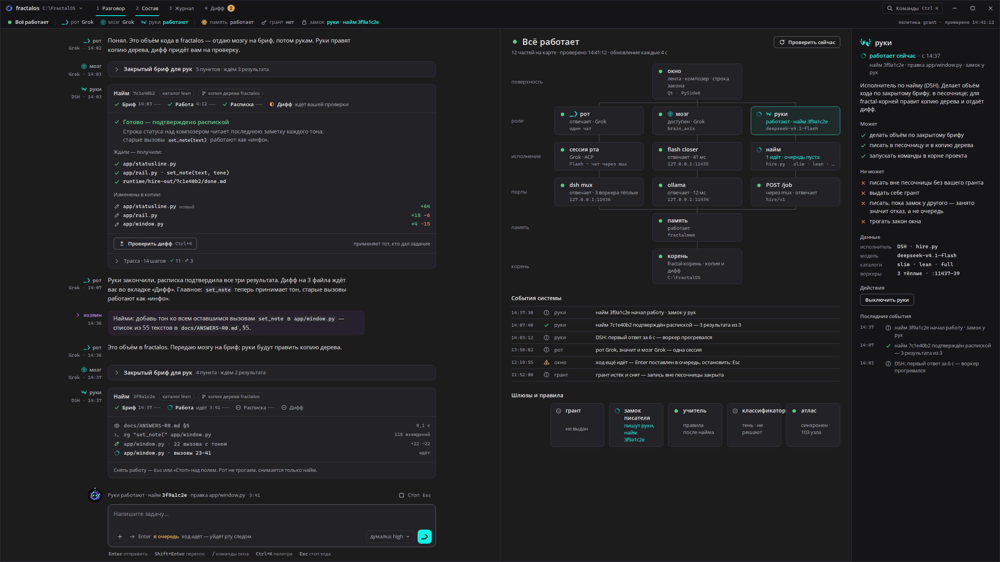 | — |

---

## 3. Информационная архитектура

```
Окно FractalOS
├── Заголовок 40px
│   ├── проект ▾  (Ctrl+P)          fractalos · C:\FractalOS
│   ├── вкладки   1 Разговор · 2 Состав · 3 Журнал · 4 Дифф [2]
│   └── Команды   (Ctrl+K) · свернуть / развернуть / закрыть
├── Строка закона 32px     ← всегда на виду, любой сегмент → «Состав»
│   общее состояние | рот · мозг · руки | память · грант · замок | политика · время проверки
└── Вид
    ├── 1 Разговор   лента (гуттер ролей + текст) → строка активности с маскотом → композер
    ├── 2 Состав     сводка → карта 12 частей → события системы → шлюзы и правила | карточка части
    ├── 3 Журнал     раунд 2
    └── 4 Дифф       раунд 2
Палитра (Ctrl+K) — поверх любого вида.  Ctrl+\ — «Разговор» и «Состав» рядом.
```

**Куда переехало содержимое рельса:**

| Было на рельсе | Стало |
|---|---|
| Рот / Мозг / Руки + `Flash │ Grok` | Строка закона + карточка роли в «Составе» (переключение там и в палитре). У рук выбора провайдера нет — его нет и в коде (§5.1) |
| `fractalmem` + 4 переключателя | Строка закона: «память работает» или «нет связи». Переключатели и числа убраны |
| Журнал runtime (hygiene) | Лента «События системы» в «Составе»; в разговор не попадает |
| Лаборатория, выбор проекта | Проект в заголовке, `Ctrl+P` |
| `[инфраструктура]` → LabCanvas | Вид «Состав»: та же карта, но с живым состоянием у каждой части |
| Скрытые секции (сессии, навигация, «Внештат») | Сессии — в «Журнал» (раунд 2); остальное не нужно |

---

## 4. Как пользоваться прототипом

| Клавиша | Что |
|---|---|
| `Ctrl+1…4` | виды |
| `Ctrl+K` | палитра команд |
| `Ctrl+P` | проект |
| `Ctrl+\` | разделить окно: разговор и состав |
| `Enter` / `Shift+Enter` | отправить / перенос строки |
| `Esc` | закрыть палитру; снять работу, если идёт найм |

- **Сценарии** — в палитре, группа «Прототип», или прямо в адресе:
  `#s=ok`, `#s=hire`, `#s=grant`, `#s=degraded`, плюс `&v=sostav&sel=mem`.
- **Попробуйте написать** в поле «найми: …», «сравни …», «/…» — строка под
  полем покажет маршрут. В сценарии `degraded` руки выключены, и «найми» даёт отказ.
- **Что работает по-настоящему:**
  - «Выключить руки»;
  - «Разрешить на 30 минут» / «На 8 часов…» / «Не разрешать»;
  - «Стоп».

  Остальные кнопки — муляжи.
- **Данные выдуманные**, но собраны из `docs/ANSWERS-R0.md`: порты, модель рук,
  CLOSE-HIRE, 118 вызовов `set_note`. Реальными их считать нельзя.

---

## 5. Решения и откуда они

### 5.1 Руки — это питание, а не выбор провайдера
Сегмент `Flash │ Grok` у рук ничего не выбирает. Оба значения ведут в один
`hire.py` на одной модели `deepseek-v4.1-flash:cloud` (ANSWERS §1). Поэтому руки
показаны как **вкл / выкл / работают**, а модель — фактом в карточке. У рта и
мозга выбор провайдера настоящий, он остался.

### 5.2 Строка закона вместо строки статуса
`set_note` — это 55 текстов и 118 вызовов, которые никто не видит (ANSWERS §5).
Одной строки для них мало: последний вызов перетирает предыдущий. Поэтому
состояние разложено так:

- **сверху** — постоянная строка закона: итог по частям, у каждой части своя клетка;
- **в «Составе»** — лента событий с тоном (инфо / предупреждение / сбой / выключено) и
  время у каждого события;
- **в разговор** система пишет, только когда это касается хода: подсказки
  памяти, деградация мозга, отказ.

### 5.3 Предпросмотр маршрута — всегда на виду
`guide.preview` ничего не запускает и не пишет (ANSWERS §3), так что показывать
его можно всегда, а не только в режиме плана. Словарь меток тот же, что в коде,
только по-русски и со штампом роли:

| В коде | Под полем |
|---|---|
| `болтовня` | Enter → рот · Grok · разговор |
| `-> найм (fit 0.72)` | Enter → найм · мозг пишет бриф, руки делают в копии дерева · уверенность 0,72 |
| `-> мозг` | Enter → мозг · суждение без кода |
| `-> разведка` | Enter → разведка · руки только читают |
| `-> руки выкл` | Enter → **отказ: руки выключены** (красным) |
| `-> отказ` | Enter → **отказ** + причина |

Пока идёт ход, первым словом будет «в очередь».

### 5.4 Грант — окно времени, а не «разово»
По коду «разово» — это таймер на 30 минут, внутри которого каждое действие
одобряется молча (ANSWERS §2). Кнопки называют это прямо: «Разрешить на 30 минут»,
«На 8 часов…» (с подтверждением), «Не разрешать». Под кнопками — закон одной
строкой: «выдать может только хозяин».

Сам запрос — отдельный золотой блок в ленте, он отличается от всего, что делают
агенты. В строке закона: «грант запрошен», «до 15:12» или «нет». Отдельно
показана политика (`grant` / `allow`). При `allow` кнопок не бывает вовсе, и
хозяин должен это видеть.

### 5.5 Память — одним словом
Память показана только как «работает» или «нет связи». Числа (атомы, подсказки
на ход) и переключатели убраны совсем — хозяин сказал, что они не нужны.

### 5.6 Найм — один объект
Этапы «бриф → работа → расписка → дифф» в одной строке. Под ними — расписка:
«ждали — получили», изменённые файлы с `+/−`, «проверить дифф». Трасса свёрнута.
Ровно этот объект потом встанет узлом в «Журнал» (раунд 2).

### 5.7 Текст хозяина — светлый, пурпур — на метке
Пурпур `#9B59D0` на тексте даёт 3.84:1 — ниже AA. Теперь пурпурные только
метка «хозяин» (`#B98AE6`, 6.4:1), значок `›` и подложка хода; сам текст — `#E4E4E4`.

### 5.8 Цвет по смыслу
| Цвет | Значит |
|---|---|
| teal | действие (кнопка отправки), фокус, текущий вид, «работает сейчас» |
| золото атома | внимание хозяина: грант, оговорка, «ждут проверки» |
| красный | лежит или отказ |
| зелёный | работает, подтверждено |

Декоративного золота в заголовках больше нет. Состояние везде передано тремя
признаками сразу: форма значка, слово, цвет.

### 5.9 Маскот остаётся
Он стоит в гуттере над композером: в покое моргает (раз в 5,4 с), при работе
вокруг идёт кольцо. Оба движения выключаются одной командой «Анимации:
выключить» и системной настройкой «уменьшить движение».

### 5.10 Длина строки и шрифты
Речь набрана Segoe UI 15px, строка не длиннее 70 символов. Пути, код, время и
трасса — Cascadia Mono. Колонка ленты — около 1000px по центру: даже на 2560 не
получится строки на 170 символов. Для тех, кто привык к ленте целиком в моно,
в палитре есть «Лента: моноширинный шрифт» — вопрос 1 в §9.

---

## 6. Компоненты — Qt: как собрать

| Компонент | Qt: как собрать |
|---|---|
| **Окно** | Безрамочный `QWidget`, `QVBoxLayout`: заголовок, строка закона, `QStackedWidget` видов. Прилипание к краям — `nativeEvent` + `WM_NCHITTEST`. |
| **Проект ▾** | `QToolButton` с иконкой и двумя `QLabel` (имя, путь моно); открывает палитру в режиме «Проект». |
| **Вкладки видов** | `QButtonGroup` из `QPushButton(checkable)`; подчёркивание 2px — QSS `border-bottom: 2px solid #09F5E5` у `:checked`; цифра — отдельный `QLabel` моно. Горячие клавиши — `QShortcut("Ctrl+1")`… |
| **Бейдж «Дифф 2»** | `QLabel` с QSS `border-radius: 9px; background: #E2A84A; color: #151517`. |
| **Строка закона** | `QHBoxLayout` из `QToolButton` (иконка + текст), состояние — динамическое свойство `setProperty("state","warn")` + QSS `QToolButton[state="warn"]`. Разделители — `QFrame` шириной 1px. Правый край — `QLabel` с `elidedText`. |
| **Лента** | Рекомендую `QScrollArea` с виджетом на ход (путь «в» из раунда 0): карточкам нужны скругления, рамки и сворачивание, а `QTextDocument` этого не умеет. Для длинных сессий — рисовать последние 200 ходов, выше — «показать раньше». Текст хода — `QLabel` с rich text и `TextSelectableByMouse`. |
| **Гуттер роли** | `QLabel` с `QPixmap` штампа (`roles/*-32.png`, масштаб до 14px) + `QLabel` имени и времени; фиксированная ширина 96px. |
| **Ход хозяина** | `QFrame` с QSS `background: rgba(155,89,208,.09); border-radius: 10px`. |
| **Бриф мозга** | `QToolButton(checkable)` со стрелкой + скрываемый `QWidget` тела; стрелка поворачивается сменой иконки, анимация не нужна. |
| **Объект найма** | `QFrame` (radius 10, рамка 1px) → шапка (`QLabel` + «чипы» — `QLabel` с radius 999) → этапы (`QHBoxLayout`: иконка + текст, соединитель — `QFrame` 18×1) → расписка → подвал с `QPushButton`. Трасса — как бриф. |
| **Запрос гранта** | `QFrame` с QSS `border: 1px solid rgba(226,168,74,.6); background: rgba(226,168,74,.08)`; факты — `QFormLayout`; три `QPushButton`. «На 8 часов…» — прежний `QMessageBox` с «Нет» по умолчанию, но в тёмном QSS. |
| **Заметка окна** | Строка: иконка тона + `QLabel`, цвет по свойству `tone`. |
| **Маскот** | Существующий `FractalMini` на 32px: тело `spirit.png` + глаза `mini-eyes.png`, моргание — `QVariantAnimation` по масштабу глаз по Y; кольцо — `QPainter` дугой с пунктиром, поворот таймером. Всё выключается флагом `motion_off` и `SPI_GETCLIENTAREAANIMATION`. |
| **Строка активности** | `QLabel` с `elidedText` + `QPushButton` «Стоп». |
| **Композер** | `QFrame` (radius 12, рамка `#6A6A72`, в фокусе `#3AB8AF` через `:focus-within` → в Qt свойство при `focusIn`/`focusOut` поля) → `QPlainTextEdit` (растёт до 190px) → ряд: `QToolButton` «+», маршрут, «думалка» (`QToolButton` с меню), отправка. |
| **Маршрут под полем** | `QLabel` (иконка + штамп + текст), обновляется из `guide.preview` по таймеру 180 мс (уже есть), без условия `plan_mode`. |
| **Кнопка отправки** | Существующий `GlyphButton "send"` 36×36, заливка teal; глиф `_>` — `mouth-cta-256.png` или `QPainterPath`. |
| **Вид «Состав»** | `QSplitter`: слева `QScrollArea` (сводка, карта, события, шлюзы), справа карточка 380px. |
| **Карта частей** | `QGridLayout` 6×4: подписи слоёв и `QPushButton(checkable)`-узлы. Рёбра рисует `paintEvent` родителя по `geometry()` узлов, путь «вниз — вбок — вниз». Пунктир у рёбер к деградировавшим и лежащим частям — `QPen(Qt::DashLine)`. |
| **Узел** | `QPushButton` с раскладкой: иконка состояния, имя (+ штамп у ролей), строка состояния, моно-строка. Выбранный — свойство `selected` в QSS. |
| **События системы** | `QTableView` или `QListView` с делегатом: время моно, иконка тона, часть, текст с `elidedText`. Источник — `set_note(text, tone)` (§7). |
| **Карточка части** | `QScrollArea` → заголовок, состояние, «Может / Не может» (`QLabel` с иконками), `QFormLayout` данных, кнопки действий, последние события. |
| **Палитра** | Безрамочный `QDialog` поверх полупрозрачной подложки (`QWidget` с `fillRect(rgba(10,10,12,.6))`), `QLineEdit` + `QListView` на `QSortFilterProxyModel`; группы — строки-заголовки в модели. Без тени (`QGraphicsDropShadowEffect` дорог), только рамка 1px. |
| **Иконки** | SVG из прототипа (`<symbol>` в начале `index.html`) → файлы `.svg` → `QIcon`; перекраска по состоянию — отдельные цвета через QSS не работают, поэтому 5 вариантов цвета или `QPainter` с `CompositionMode_SourceIn`. |
| **Шрифты** | Segoe UI — системный; Cascadia Mono — встроить в ресурсы (`assets/fonts/README.md`). |

---

## 7. Что потребует правок в коде FractalOS

Сами прототипы ничего не меняют. Это список для локальной команды — что нужно,
чтобы окно стало таким:

1. **`Rail.set_note(text, tone)`** плюс хранилище последних N событий. Тон нужен в
   коде, а не угадывается по подстроке (ANSWERS §5, п. 3).
2. **`_on_ghost`**: убрать выход при выключенном `plan_mode`
   (`app/window.py:4748-4753`); подписи меток — по таблице §5.3.
3. **Строку рук упростить до питания.** Сегмент провайдера убрать; убрать литерал
   «слот Flash» (`app/window.py:8623`) и побочное включение рук кликом по
   сегменту (`app/window.py:8184`).
4. **Память** в строке закона — одно состояние: работает / нет связи.
5. **Тексты кнопок гранта**: «Разрешить на 30 минут» / «На 8 часов…» / «Не
   разрешать» (`app/chatpane.py:1283-1292`). В строку закона — срок гранта из
   `approve.status()` и действующая политика.
6. **Пробы портов**: третье состояние «не ответил вовремя» (таймаут 0,4 с), иначе
   будут ложные «лежит» (ANSWERS §6, п. 4).
7. **LabCanvas**: узел «Учитель» устарел (ANSWERS, расхождение 10). В «Составе» он
   заменён на «сессию рта», а учитель стал правилом в «шлюзах и правилах». Связь
   «сессия рта → dsh mux» (Flash-чат через mux) нужно сверить с кодом.

---

## 8. Проверки перед сдачей

- **Детектор Impeccable:** `impeccable detect --json rounds/01-terminal/index.html` → `[]`.
  Хук после каждой правки замечаний тоже не дал.
- **Web Interface Guidelines** (снимок правил от 2026-09-24) — по коду прототипа
  исправлены три места:
  - поле палитры получило имя и роль `combobox`;
  - видимый фокус у поля палитры;
  - `aria-hidden` у декоративных SVG.

  Остальное соблюдено: семантические кнопки, `:focus-visible`,
  `aria-live` у строки закона, маршрута и активности, `prefers-reduced-motion` и
  свой выключатель анимаций, анимируются только `transform` и `opacity`, `…` и «ёлочки»,
  `translate="no"` у путей и кода, `color-scheme: dark`, обрезка длинных строк,
  подтверждение гранта на 8 часов.
- **Контраст текста:** проверены все фоны, где лежит серый текст, включая
  наведение и выделение. Два места не проходили, оба исправлены:
  - моно-строка узла при наведении — было 4.33:1, текст стал светлее;
  - подпись и клавиша в выделенной строке палитры — было 2.67:1, стали основного цвета.

  Теперь все пары ≥ 4.5:1. Самая слабая — `#8E8E97` на выбранном узле, 4.54:1.
- **Сеть:** `tools/shots.mjs` обрывает любой внешний запрос — таких не было.
- **Финальная проверка Impeccable** — `⚠️ DEGRADED: в одном контексте`, без
  отдельного субагента: по правилам сессии субагентов запускаю только по прямой
  просьбе хозяина.
  - Итог — **fix**, два пункта: «События системы» уходили под сгиб в «Составе»
    при 900px; правый край строки закона мог обрезаться.
  - После исправления повторная проверка оценила оба как решённые, итог по ним —
    **ship**. Это оценка только этих двух исправлений, а не всей поверхности.
- **`DESIGN.md` не написан намеренно.** Дизайн-система собирается в финальном
  раунде (`design-system/`), а описывать её сейчас значит закрепить то, что ещё
  поменяется. Решение — `DECISIONS.md` 1.6.
- **Мобильных снимков нет:** продукт только для десктопа (`PRODUCT.md`).

---

## 9. Открытые вопросы

1. **Шрифт ленты:** речь пропорциональным (как в прототипе) или всё моно, как
   сейчас в окне? Сравнить можно в палитре: «Лента: моноширинный шрифт».
2. ~~Как называть память~~ — снят: хозяин не хочет чисел, память показана словом «работает» / «нет связи».
3. **Разделение на 2560:** включать его само на широком окне или только по `Ctrl+\`?
4. **«Журнал» и «Дифф»** строятся в раунде 2. Что важнее первым: журнал сессий или
   приёмка диффа?

---

## 10. Что дальше: раунд 2

Раунд 2 — сходимость по вашему отклику:

- виды «Журнал сессий» и «Дифф на проверку»;
- экран ошибок (вероятно, как режим «Состава»);
- слэш-меню в композере;
- `impeccable polish` и аудит перед сдачей.

**Жду отклика хозяина.**
