# Раунд 2 — журнал сессий

> Хозяин выбрал: сначала журнал сессий, проверка диффа — потом. Раунд строит вид
> «Журнал» внутри окна из раунда 1. Всё остальное в окне не менялось. Дата: 2026-09-24.
>
> **Открыть:** двойной клик по `index.html`. Журнал — вкладка `3 Журнал`
> (`Ctrl+3`) или кнопка «рядом: Журнал» в заголовке.

## 1. Коротко

- **Журнал отвечает на три вопроса хозяина:** что было, что сделали руки, чем кончилось.
- **Слева — сессии по дням** («Сегодня», «Вчера», «Понедельник, 22 сентября»). У
  каждой: название, время, проект, сколько наймов и чем они кончились, метки
  «дифф ждёт», «сбой», «грант», «идёт найм». Сверху — поиск (`Ctrl+F`) и
  фильтры «Ждут проверки», «Со сбоями», «С грантами» со счётчиками.
- **Справа — выбранная сессия:**
  - **«Чем кончилось»** — одной фразой, крупно;
  - **сводка** — сколько было наймов, сколько диффов ждут проверки, сколько
    выдавалось грантов и сколько было сбоев;
  - **хронология** — задача хозяина → бриф мозга → найм рук → гранты → сбои →
    ответ рта. Разговор пересказан, а не повторён целиком.
- **Найм в журнале** — та же карточка, что в ленте, только свёрнутая:
  - исход — подтверждено / без подтверждения / не дошло / идёт / ждёт гранта;
  - что с диффом — ждёт проверки / применён в 19:26 / не нужен / внешний проект;
  - что внутри: «почему», ждали — получили, изменённые файлы, хвост лога;
  - повторный найм помечен «повтор 2c11e0f4».
- **Из журнала можно** открыть сессию в разговоре, выгрузить её в markdown, убрать
  в архив (с подтверждением) и перейти к проверке диффа.
- **Журнал работает и рядом с разговором.** Если панель узкая, список сессий
  встаёт над карточкой.

## 2. Снимки

| # | Что | 1440×900 | 1920×1080 |
|---|---|---|---|
| 01 | Текущая сессия: найм готов, дифф ждёт | 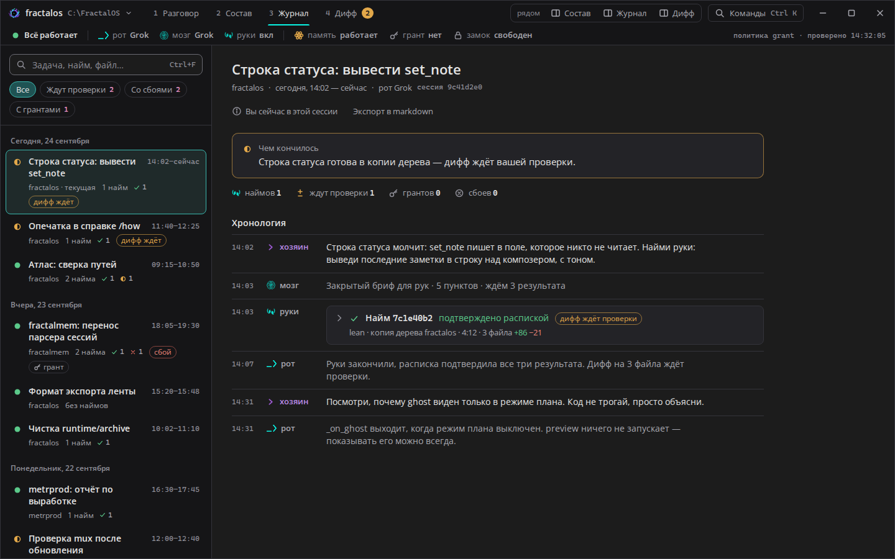 | 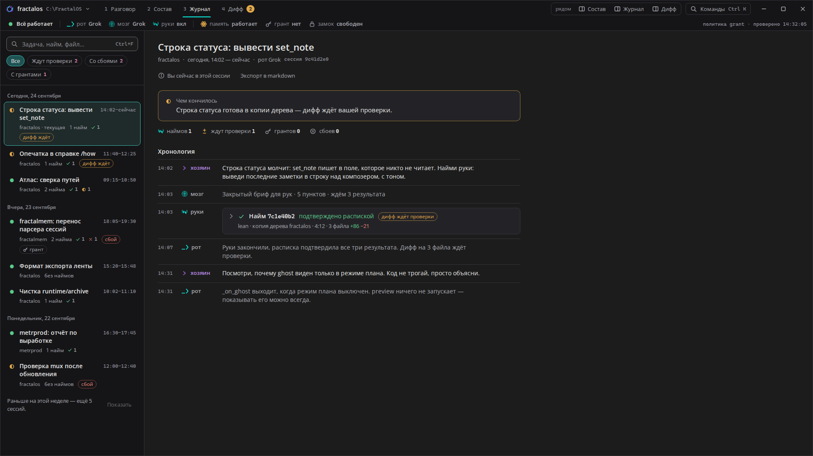 |
| 02 | Вчерашняя: найм упал на тесте → повтор прошёл → грант → дифф применён | 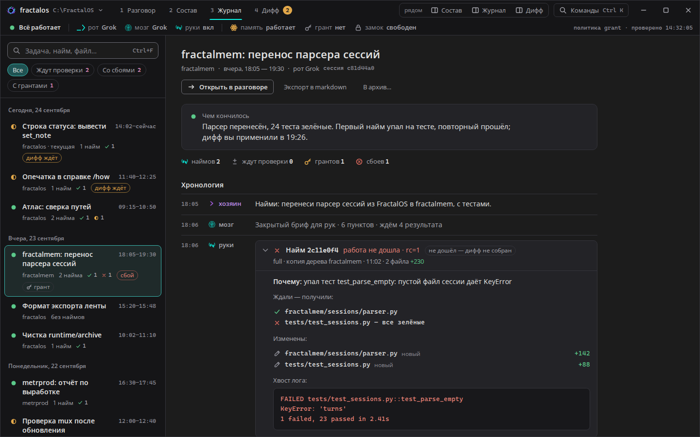 | 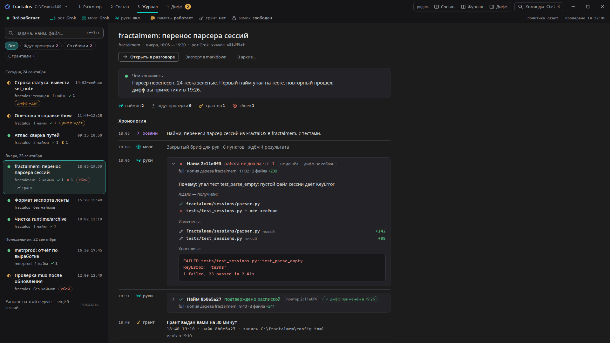 |
| 03 | Фильтр «Ждут проверки» | 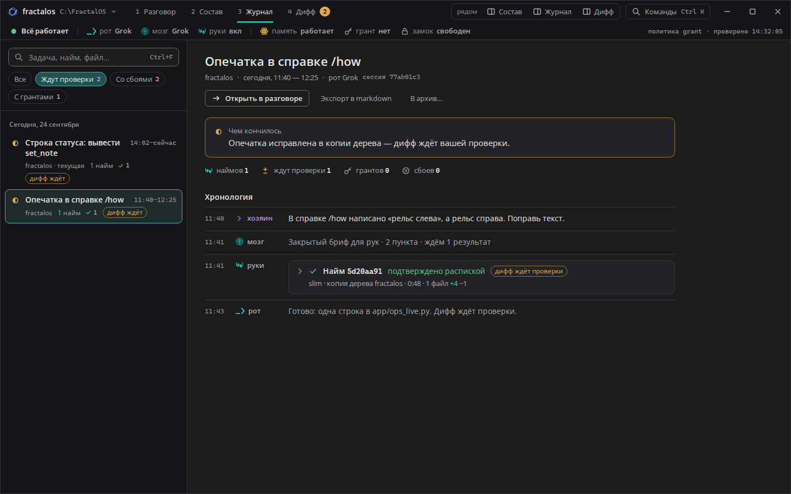 | 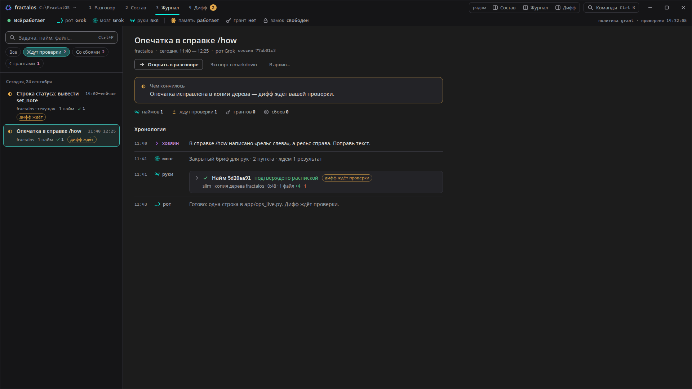 |
| 04 | Сейчас идёт найм, руки ждут гранта | 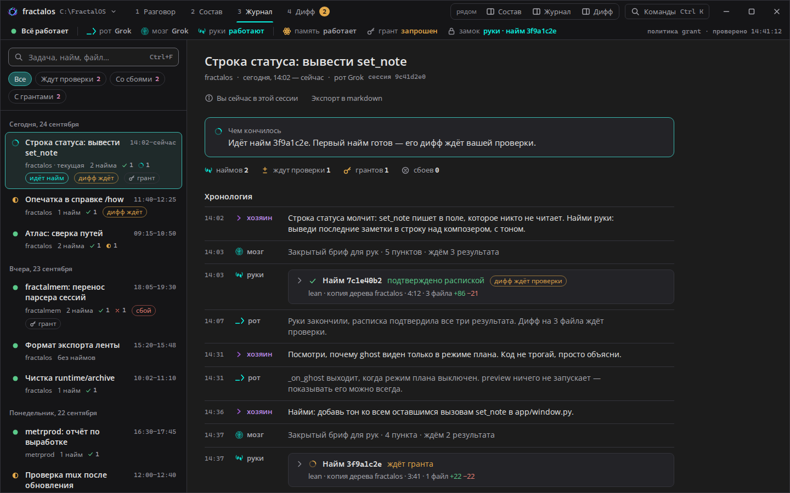 | 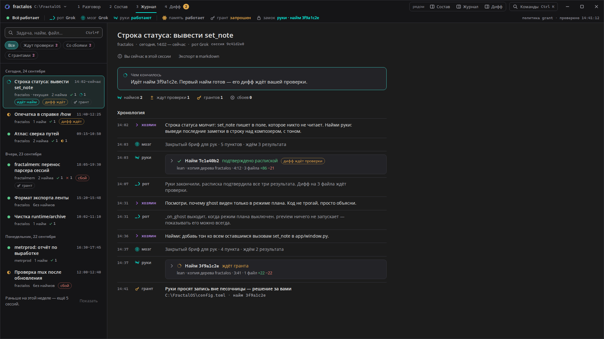 |
| 05 | Поиск ничего не нашёл | 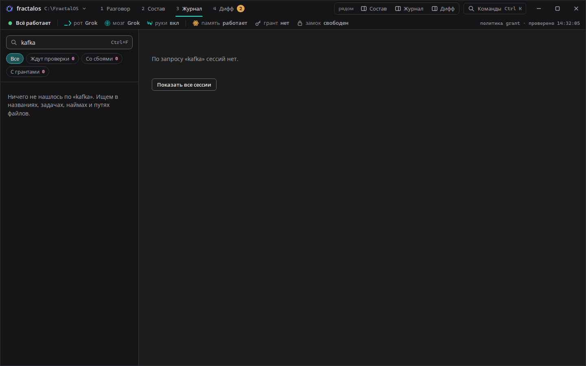 | 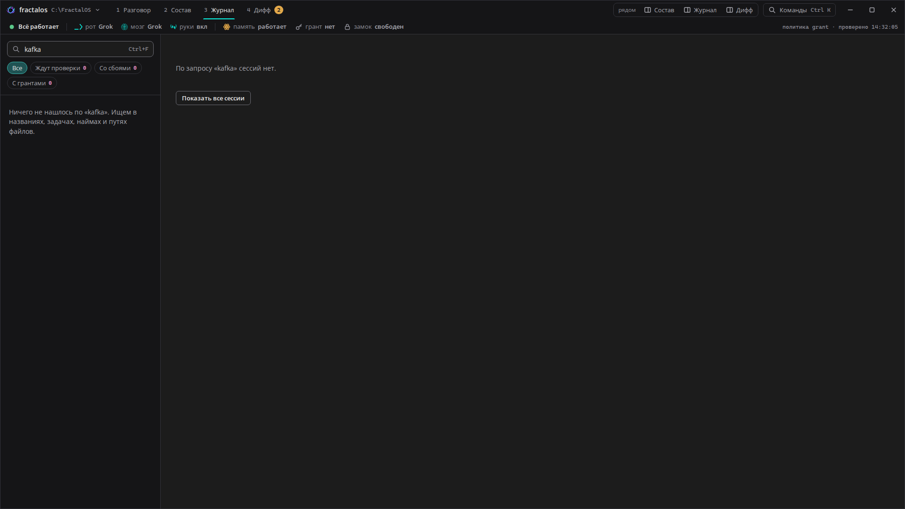 |
| 06 | Журнал рядом с разговором (на 1440 список встаёт сверху) | 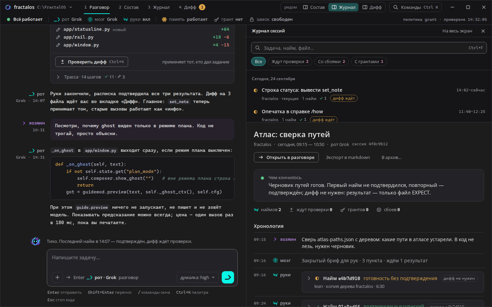 | 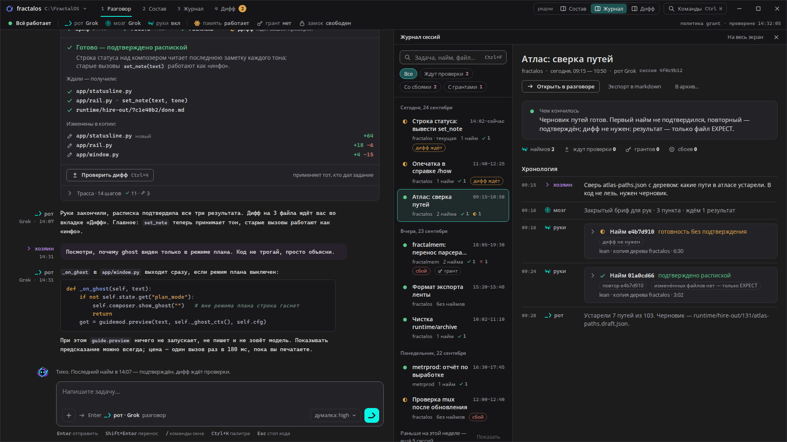 |
| 07 | 2560×1440: журнал рядом с разговором | 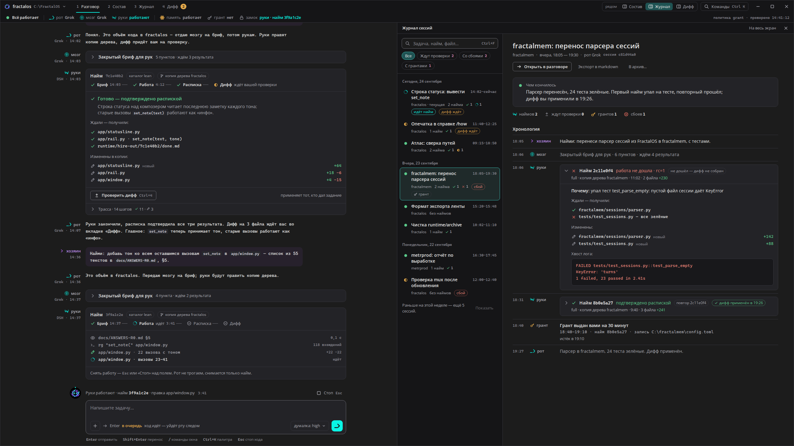 | — |

## 3. Как устроен журнал

```
Журнал
├── Список (340px)
│   ├── Поиск  (Ctrl+F · Esc — очистить)
│   ├── Фильтры  Все · Ждут проверки N · Со сбоями N · С грантами N
│   └── Дни → сессии
│         [исход] Название (до 2 строк)                    14:02–сейчас
│                 проект · N наймов ✓ ◐ ✕ ◌ · [дифф ждёт] [сбой] [грант]
└── Сессия
    ├── Название · проект · день, время · рот · id сессии
    ├── Открыть в разговоре · Экспорт в markdown · В архив…
    ├── Чем кончилось — одна фраза
    ├── наймов N · ждут проверки N · грантов N · сбоев N
    └── Хронология: время · кто · что
          хозяин — задача (до 3 строк)
          мозг   — закрытый бриф: N пунктов, ждём N результатов / вердикт
          руки   — найм (сворачивается): исход, дифф, почему, файлы, хвост лога
          грант  — кто выдал, на сколько, для какого найма, куда писали, когда закрылся
          окно   — сбои и оговорки с тоном
          рот    — итог ответа одной-двумя фразами
```

**Исход сессии** (значок слева в списке и в «Чем кончилось»):

| Значок | Когда |
|---|---|
| ● зелёный | всё закрыто: наймы подтверждены, диффы применены или не нужны |
| ◐ золотой | ждёт вас: дифф на проверку или найм без подтверждения |
| ⊗ красный | кончилось сбоем, который не исправлен |
| ◌ бирюзовый | прямо сейчас идёт найм |

**Клавиатура:**
- `Ctrl+3` — журнал на весь экран;
- «рядом: Журнал» — рядом с разговором;
- `Ctrl+F` — поиск, `Esc` — очистить его;
- `↑↓` — по сессиям;
- `Tab` — к хронологии, `Enter` на найме — раскрыть.

## 4. Решения

- **Хронология — пересказ, а не лента.** Полный разговор остаётся в «Разговоре»;
  журнал отвечает на вопрос «что было и чем кончилось». Поэтому задача хозяина —
  до трёх строк, ответ рта — одна-две фразы, а найм — одна свёрнутая строка.
- **«Чем кончилось» — отдельная фраза сверху.** По ней видно, закрыта ли
  сессия, не открывая наймы.
- **Фильтры отвечают на частые вопросы хозяина:** что ждёт моей проверки, где
  был сбой, где выдавался грант. Счётчик на фильтре показывает ответ ещё до
  нажатия.
- **Повтор найма помечен связью** «повтор 2c11e0f4»: видно, что второй найм —
  исправление первого, а не новая работа.
- **Внешний проект (metrprod)** явно помечен «без приёмки»: руки пишут там в живое
  дерево по его правилам, и это не нарушение закона fractal-корней.
- **Текст журнала — обычным шрифтом.** Моноширинный выбран для ленты разговора,
  а журнал — это отчёт. Пути, id и время — моноширинные, как везде.

## 5. Что нужно в данных FractalOS

Для локальной команды: что журнал берёт из уже существующих данных и чего пока не хватает.

| Что показывает журнал | Есть сейчас | Не хватает |
|---|---|---|
| Список сессий, время, название | `app/session.py: list_mouth_sessions` (время + заголовок) | конец сессии и проект у каждой сессии |
| Наймы сессии, бриф, расписка, изменённые файлы | `runtime/dispatch/<sid>/`, `done.md`, EXPECT | — |
| Исход найма (подтверждено / нет / не дошло), `почему`, хвост лога | карточка расписки (`app/chatpane.py:2054-2144`) | сохранять исход в `dispatch/<sid>/`, а не только рисовать |
| Повтор найма → какой найм он повторяет | текст «повтор найма: тот же бриф» | id исходного найма |
| Дифф: ждёт / применён (когда) / отклонён | — | записывать решение по диффу; появится вместе с видом «Дифф» |
| Гранты сессии: кто, на сколько, для какого найма, куда писали | `approve.grant` хранит **только текущий** грант | журнал выдачи и снятия грантов |
| Сбои и оговорки сессии | `set_note` — не сохраняется | `set_note(text, tone)` с записью в журнал сессии |
| «Чем кончилось» | — | фраза от учителя (правила CLOSE-HIRE) или из последней расписки и ответа рта |

## 6. Компоненты — Qt: как собрать

| Компонент | Qt: как собрать |
|---|---|
| **Вид «Журнал»** | `QSplitter`: слева список 340px, справа карточка; если ширина меньше 760px, `resizeEvent` переводит сплиттер в вертикальное положение (список сверху, 250px). |
| **Поиск** | `QLineEdit` с иконкой, фильтрация с задержкой 150 мс; `Esc` — очистить, `QShortcut("Ctrl+F")` — фокус. |
| **Фильтры** | `QButtonGroup(exclusive)` из `QPushButton(checkable)` в QSS «таблетки»; счётчик — часть текста кнопки. |
| **Список сессий** | `QListView` + `QSortFilterProxyModel` + свой `QStyledItemDelegate`: строки дней — отдельный тип строки, у сессии две-три строки текста, метки рисуются `QPainter` (скруглённый прямоугольник + текст). Виртуализация даром; `↑↓` работают сами. |
| **Карточка сессии** | `QScrollArea` → заголовок (`QLabel` 22px), подпись, `QHBoxLayout` кнопок, блок «Чем кончилось» (`QFrame` с рамкой цвета исхода), строка сводки. |
| **Хронология** | `QVBoxLayout` строк: время (моно), кто (штамп + имя), тело. Строки разделены линией 1px. |
| **Найм в хронологии** | тот же виджет найма, что в ленте (раунд 1), в свёрнутом режиме: шапка — `QToolButton(checkable)` со стрелкой, тело скрывается. |
| **Пустые состояния** | `QLabel` + `QPushButton` «Показать все сессии» вместо карточки. |

## 7. Проверки перед сдачей

- **Детектор Impeccable** — `impeccable detect --json rounds/02-journal/index.html` → `[]`.
- **`impeccable polish`** — пройден по всему пути, найдено и исправлено:
  - названия сессий обрезались на полуслове — теперь переносятся на вторую строку;
  - при пустом поиске справа было «Выберите сессию слева» — теперь понятное
    сообщение и кнопка «Показать все сессии»;
  - найм, ждущий гранта, был бирюзовым «работает» — теперь золотой «ждёт вас»;
  - карточка сессии лишний раз объявлялась экранному диктору при каждом выборе —
    объявление убрано.
- **Аудит по Web Interface Guidelines:**
  - у поиска есть подпись для диктора;
  - фильтры — кнопки с `aria-pressed`;
  - строки списка — кнопки, по ним ходят стрелки;
  - найм раскрывается родным `details`;
  - длинные строки обрезаются или переносятся;
  - пустые состояния с выходом есть;
  - «…» и «ёлочки» на месте;
  - `translate="no"` у путей.
- **Контраст** — все новые пары ≥ 4.5:1, включая наведение и выбранную строку.
  Самая слабая — время на выбранной строке, 4.54:1.
- **Сеть** — запросов нет.
- **Финальная проверка Impeccable** — `⚠️ DEGRADED: в одном контексте`, без
  субагента: по правилам сессии субагентов запускаю только по прямой просьбе
  хозяина.
  - Мир раунда 1 соблюдён: те же токены, штампы ролей, значки состояний.
    Запрещённых приёмов нет: ни кикеров, ни полос слева, ни эмодзи вместо иконок.
  - Исправлений не требуется, итог — **ship**.

## 8. Что дальше

Следующий раунд — **проверка диффа**: изменения рук по файлам и действия
«применить», «отклонить», «повторить найм». Журнал уже ведёт туда кнопкой
«Проверить дифф».
