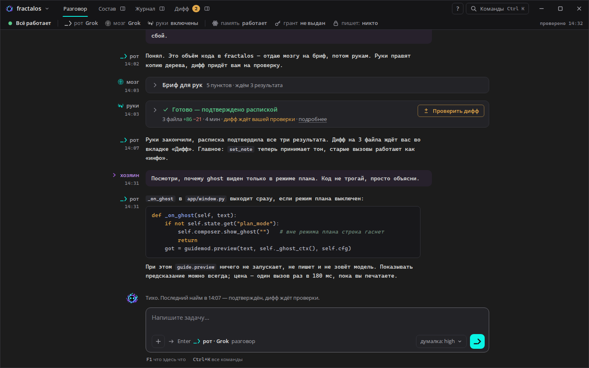
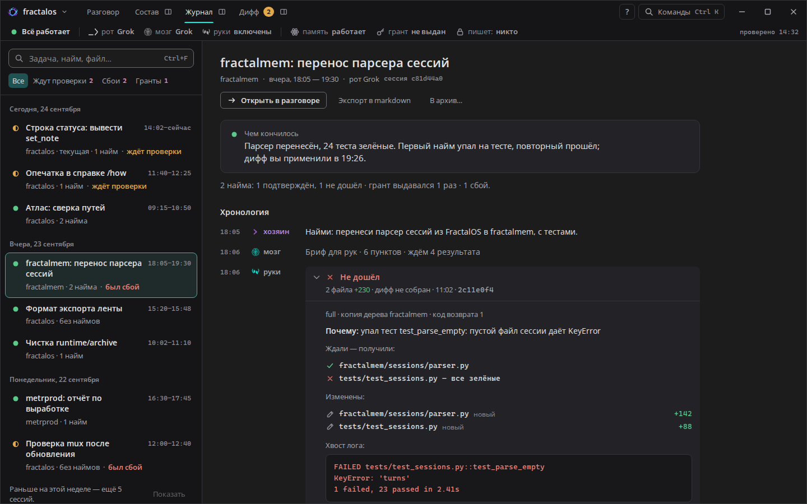
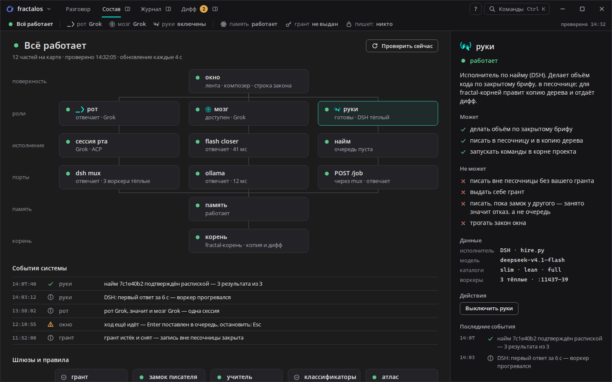
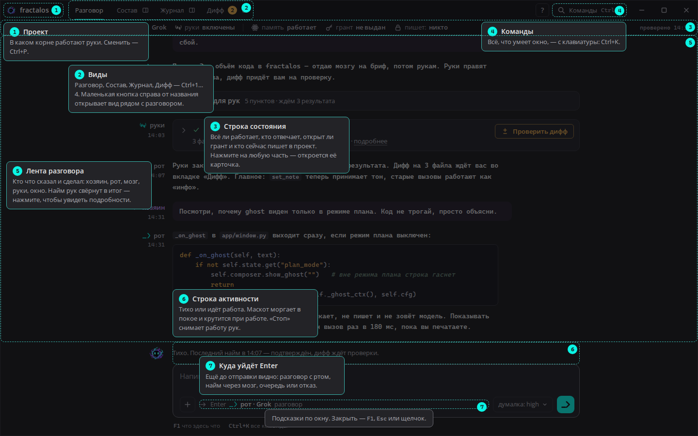

# Раунд 3 — ясность

> **Просьба хозяина:** «Непривычный интерфейс, кажется, что всё нагромождено…
> Пока всю выведенную пользу сохранять, восприятие и понимание смысла —
> улучшить, сделать более доступным». В журнале оставить обычный шрифт.
>
> Раунд ничего не удаляет. Всё, что было на экране, осталось в окне:
> второстепенное стало тише или ушло на один щелчок либо в подсказку при
> наведении. Главное стало заметнее. Добавлены подсказки по окну (`F1`).
> Дата: 2026-09-24.

## 1. Было → стало

| | Было (раунды 1–2) | Стало |
|---|---|---|
| Разговор |  |  |
| Журнал |  |  |
| Состав |  |  |
| Подсказки (`F1`) | — |  |

Остальные снимки — в `shots/`, в 1440×900 и 1920×1080:
- идёт найм (`02`);
- грант (`03`);
- оговорки (`04`);
- журнал, текущая сессия (`06`);
- подсказки в журнале (`09`);
- 2560 с журналом рядом (`10`).

## 2. Что именно мешало и что сделано

| Что мешало | Что сделано |
|---|---|
| **Два ряда одинаковых кнопок:** вкладки и отдельная группа «рядом» с теми же названиями | Кнопка «открыть рядом» — маленький значок справа от названия вкладки. Отдельной группы больше нет. |
| **Вся строка состояния одинаково яркая**, иконки цветные | В норме значки серые, текст спокойный. Цветом выделено только отклонение: золото — оговорка, красный — лежит, бирюза — работает прямо сейчас. |
| **Коды вместо слов:** «замок свободен», «грант нет», «руки вкл» | Слова: «пишет: никто», «грант не выдан», «руки включены». |
| **«политика grant · проверено 14:32:05»** всегда на виду | Осталось «проверено 14:32». Политика появляется только когда она опасная — «запись без гранта». |
| **Итог найма в ленте раскрыт целиком:** этапы, списки файлов, трасса | Итог — две строки: исход, файлы, состояние диффа и кнопка «Проверить дифф». Остальное — по щелчку «подробнее». |
| **Провайдер под каждым ходом** («Grok · 14:02») | Под ролью только время. Провайдер показан, если он не тот, что в строке состояния, и всегда виден при наведении. |
| **Внизу пять клавиш-подсказок** | Две: `F1` — что здесь что, `Ctrl+K` — все команды. Остальные клавиши — в подсказках и палитре. |
| **Путь проекта в заголовке** рядом с именем | Путь — в подсказке к кнопке проекта и в карточке «корень» в «Составе». |
| **Журнал:** фильтры-«таблетки» в две строки, у каждой сессии три строки меток | Фильтры — одна строка. У сессии две строки: название и «проект · сколько наймов · **главное слово**» — «ждёт проверки», «был сбой» или «идёт найм». |
| **Журнал:** сводка — четыре иконки с числами | Одна фраза: «2 найма: 1 подтверждён, 1 не дошёл · грант выдавался 1 раз · 1 сбой.» |
| **Журнал:** линии между строками хронологии, рамки у наймов | Строки разделены воздухом, найм — на тихой подложке без рамки. В первой строке найма — исход словами («Не дошёл», «Повтор. Подтверждено распиской»), id — в конце второй. |
| **Состав:** у каждой части третья строка — порт или модель | На карте: имя и состояние. Порты, модели и адреса — в карточке части справа, в «Данных». |
| **Непонятно, что где и зачем** | **Подсказки по окну:** `F1` или кнопка «?». Подписи прямо поверх окна, с номерами: проект, виды, строка состояния, команды, лента, строка активности, «куда уйдёт Enter». В журнале и составе — свои подсказки. |

## 3. Где теперь то, что стало тише

Ничего не удалено — проверка по списку:

| Было на виду | Где теперь |
|---|---|
| Путь проекта `C:\FractalOS` | подсказка кнопки проекта; «Состав» → корень |
| Цифры 1–4 на вкладках | подсказка вкладки, палитра, подсказки `F1` |
| Группа «рядом: Состав · Журнал · Дифф» | значок справа от каждой вкладки |
| Политика гранта (`grant`) | «Состав» → грант; в строке состояния, если опасная |
| Секунды времени проверки | «Состав» → сводка |
| Провайдер у каждого хода | строка состояния; подсказка у роли; показывается, если отличается |
| Этапы найма, «ждали — получили», изменённые файлы, трасса, id, каталог, копия дерева | «подробнее» в итоге найма |
| Подсказки клавиш внизу | подсказки `F1`, палитра `Ctrl+K`, подсказки кнопок |
| id найма, каталог, дерево, код возврата в журнале | вторая строка найма и его раскрытая часть |
| Порты, модели, адреса на карте «Состава» | карточка части → «Данные» |
| Метки «грант» и счётчики ✓◐✕ у сессий в журнале | фильтр «Гранты»; сводка сессии; хронология |

## 4. Компоненты — Qt: как собрать (новое и изменённое)

| Компонент | Qt: как собрать |
|---|---|
| **Вкладка со значком «рядом»** | `QPushButton` вкладки + `QToolButton(checkable)` 24×24 справа от неё в одном `QHBoxLayout`; нажатое состояние — QSS `:checked`. |
| **Серые значки в строке состояния** | Отдельные серые варианты PNG-штампов (или перекраска `QPainter` с `CompositionMode_SourceIn`); цвет только у значения — QSS по свойству `state`. |
| **Итог найма в две строки** | `QToolButton(checkable)` на всю ширину с двумя `QLabel` (rich text) + отдельная `QPushButton` «Проверить дифф» справа в той же `QGridLayout`; тело — скрываемый `QWidget`. |
| **Сводка сессии фразой** | Один `QLabel`; фраза собирается в коде с правильным склонением (как `mem_offer_word` в `app/window.py:500-516`). |
| **Фильтры журнала** | `QButtonGroup(exclusive)` из плоских `QPushButton(checkable)` без рамки; выбранная — фон `#1F5353`. |
| **Подсказки по окну (`F1`)** | Прозрачный `QWidget` поверх окна (`setAttribute(WA_TransparentForMouseEvents, False)`, закрытие по щелчку): в `paintEvent` — затемнение, пунктирные прямоугольники по `mapTo(window, widget.geometry())` и номера; подписи — `QLabel` с рамкой. Раскладка подписей: если подпись задевает предыдущую, она сдвигается ниже. Открыть и закрыть — `QShortcut("F1")`, закрыть — `Esc`. |

## 5. Проверки перед сдачей

- **Детектор Impeccable:** `impeccable detect --json rounds/03-clarity/index.html` → `[]`.
- **`impeccable quieter` / `clarify`** — применены как сказано в §2. Инструмент
  стал тише: меньше цвета, рамок и повторов. Подписи стали словами, а не
  кодами. Характер сохранён: штампы ролей, маскот, золото и бирюза на месте.
- **Осмотр в два круга по снимкам** — исправлено:
  - подписи подсказок налезали друг на друга;
  - номер на рамке подсказки обрезался краем окна;
  - «не дошёл» у упавшего найма повторялся дважды;
  - «пишет руки» — теперь «пишет: руки».
- **Контраст новых пар** — ≥ 4.5:1:
  - слово состояния сессии на тёмном и при наведении — золото 6.66, красный 5.49;
  - подпись подсказки 6.63;
  - серые значки в строке состояния 5.62 (для значков хватило бы 3:1).
- **Клавиатура:**
  - `F1` открывает и закрывает подсказки, `Esc` закрывает;
  - у значка «рядом» есть имя для экранного диктора: «Открыть рядом с разговором: …»;
  - «подробнее» у найма — родной `details`.
- **Финальная проверка Impeccable** — `⚠️ DEGRADED: в одном контексте`, без
  субагента (по правилам сессии). Мир окна не изменился, запрещённых приёмов
  нет. Итог — **ship**.

## 6. Что дальше

Экран проверки диффа — изменения рук по файлам и действия «применить»,
«отклонить», «повторить найм». Он строится уже в новой, более тихой манере.
