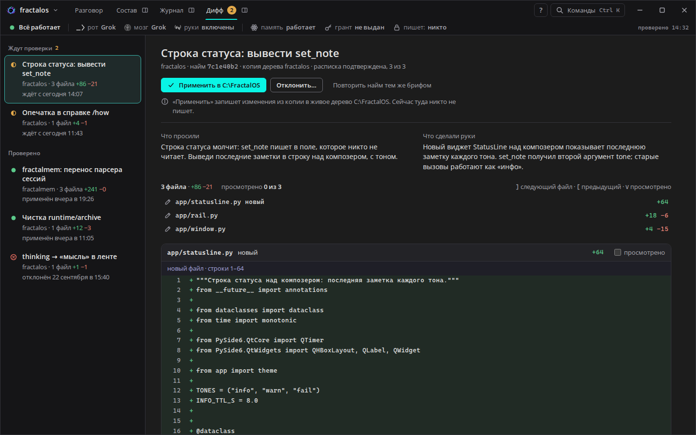

# Раунд 4 — дифф на проверку

> **Просьба хозяина:** «Сделай пока так, для beta версии сойдёт, остальные
> правки после пользования… делай экран проверки diff».
>
> Раунд 3 (ясность) принят как есть и идёт в beta. Этот раунд добавляет
> последний большой вид из плана — «Дифф». Он сделан в той же тихой манере:
> цвет только у главного, подробности на один щелчок, подсказки по `F1`.
> Прототип — `rounds/04-diff/index.html`, открывается двойным щелчком.
> Дата: 2026-09-24.

## 1. Что на экране

Руки правят не живой проект, а **копию дерева**. Когда найм подтверждён
распиской, его изменения ждут хозяина. Этот экран отвечает на три вопроса:
**что просили**, **что сделали руки** и **что будет, если нажать «Применить»**.

| Часть | Что показывает |
|---|---|
| **Очередь** (слева) | «Ждут проверки» — золотой значок и сколько ждёт; «Проверено» — применённые (зелёный) и отклонённые (красный). У каждой строки: задача, проект, файлы и +/−, с какого времени ждёт или когда решено. |
| **Заголовок** | Задача словами; мелко — проект, id найма, где правили руки (копия дерева), расписка «подтверждена, 3 из 3». |
| **Решение** | «Применить в C:\FractalOS» — главная кнопка, бирюзовая. «Отклонить…» и «Повторить найм тем же брифом» — тише. |
| **Что произойдёт** | Под кнопками одна строка: куда запишется и кто сейчас пишет в проект. |
| **Зачем это** | Две колонки: «Что просили» (текст задачи) и «Что сделали руки» (итог из расписки). Так проверяется смысл, а не только строки. |
| **Файлы** | Сколько файлов, +/−, «просмотрено X из N», список файлов со ссылками. Ниже — сами изменения: зелёным добавлено, красным убрано, номера строк старые и новые. |

Над каждым куском изменений написано словами, где он: «строки 1375–1395 ·
class Rail(QWidget):». Для нового файла — «новый файл · строки 1–64». Сырой
заголовок `@@ -1375,9 +1375,21 @@` виден в подсказке при наведении.

## 2. Как это работает (сценарии)

| Сценарий | Что видно | Снимок |
|---|---|---|
| **Проверяю по файлам** | Отметка «просмотрено» сворачивает файл и считает прогресс. Клавиши: `]` — следующий файл, `[` — предыдущий, `V` — отметить (работают и в русской раскладке: `ъ`, `х`, `м`). | `02` |
| **В проект сейчас пишут руки** | «Применить» выключена. Под ней: «Сейчас в проект пишут руки (найм 3f9a1c2e). Писать может только один — применить можно, когда они закончат или вы снимете работу». Отклонить и повторить можно. | `03` |
| **Отклоняю** | «Отклонить…» раскрывает поле «Что не так?». Причина необязательна. Два исхода: «Отклонить» — живое дерево не тронуто, причина записана; «Отклонить и повторить найм с этой правкой» — причина уходит в бриф нового найма. | `04` |
| **Применил** | Строка «Применён вами сегодня в 14:52 — изменения записаны в C:\FractalOS». Дифф уходит в «Проверено», счётчик на вкладке уменьшается. В ленте разговора — запись окна, итог найма меняется на «дифф применён вами», кнопка становится тихой «Открыть дифф». Строка активности тоже. | `05`, `06` |
| **Применяю, не всё посмотрев** | Окно спрашивает: «Вы просмотрели 2 из 3 файлов. Применить все изменения в C:\FractalOS?» Не запрещает — хозяин решает сам. | — |
| **Смотрю старое решение** | Отклонённый дифф: причина в кавычках, файлы раскрыты. Отметок «просмотрено» нет — это запись, а не работа. | `07` |
| **Рядом с разговором** | Значок у вкладки «Дифф» открывает очередь и дифф справа от ленты. На узкой панели очередь встаёт сверху. | `08`, `10` (2560) |
| **Не понимаю, что где** | `F1` — подписи поверх окна: очередь, решение, «зачем это», файлы. | `09` |

Вход на экран:
- вкладка «Дифф» (`Ctrl+4`) с золотым счётчиком;
- кнопка «Проверить дифф» в итоге найма в ленте;
- та же кнопка в журнале сессий;
- палитра `Ctrl+K` → «Следующий дифф на проверку».

## 3. Инварианты, которые видны на экране

- **Применяет только хозяин.** Дифф применяет тот, кто дал задание. В окне это
  одна кнопка у хозяина, у рук и мозга такой нет. Решение записывается в ленту
  как «применён вами».
- **Один пишущий.** Пока в проект пишут руки, «Применить» выключена, и сказано
  почему. Это тот же замок, что в строке состояния («пишет: руки»).
- **Руки не пишут в живое дерево сами.** Заголовок каждого диффа говорит
  «копия дерева fractalos». Живое дерево меняется только через «Применить».
- **Расписка до проверки.** В очереди только наймы, подтверждённые распиской;
  в заголовке — «расписка подтверждена, 3 из 3».

## 4. Компоненты — Qt: как собрать

| Компонент | Qt: как собрать |
|---|---|
| **Очередь диффов** | `QListView` + `QStyledItemDelegate`. Две группы — заголовки-строки без выбора (`Qt::ItemIsEnabled` без `ItemIsSelectable`). Выбранная строка — рамка `#3AB8AF` и фон `#1F2A2A` в `paint()`. Значок состояния — те же PNG, что в журнале. |
| **Кнопки решения** | `QPushButton` ×3 в `QHBoxLayout`. «Применить» — `objectName="primary"`: QSS `background:#09F5E5; color:#151517`, в `:disabled` — прозрачный фон, рамка `#6A6A72`, текст `#A8A8B0`. «Отклонить…» — `setCheckable(true)` и раскрывает панель. |
| **Строка «что произойдёт»** | `QLabel` с `wordWrap` и значком слева (`QHBoxLayout`). Текст меняется по сигналу замка (`lock_changed`). |
| **Панель «Отклонить»** | `QFrame` с рамкой `#34343B` и радиусом 8: `QLabel` + `QPlainTextEdit` (2 строки, `placeholderText`) + три кнопки. «Отклонить» — QSS: красная рамка и текст `#EC8579`. Показ и скрытие — `setVisible`, без анимации. |
| **«Что просили / что сделали»** | Два `QLabel(wordWrap)` в `QGridLayout` на две колонки; на узкой панели — одна колонка (по `resizeEvent`). |
| **Список файлов** | `QListWidget` без рамки или `QVBoxLayout` из плоских `QPushButton`: путь моноширинным, «новый», `+N −M` справа. Щелчок — `QScrollArea.ensureWidgetVisible(section)`. |
| **Файл с изменениями** | Заголовок — `QWidget` с `QHBoxLayout`: путь, +/−, `QCheckBox("просмотрено")`. Тело — `QPlainTextEdit(readOnly)` с моноширинным шрифтом. Подложки строк: `QTextEdit.ExtraSelection` с `QTextFormat.FullWidthSelection`, цвета `rgba(91,201,138,.09)` и `rgba(224,106,94,.09)`. Номера строк — поле слева, как в примере Qt «Code Editor» (`lineNumberArea` + `paintEvent`), два столбца: старый и новый. Подсветку синтаксиса можно добавить позже через `QSyntaxHighlighter`. Альтернатива — `QTableView` на три колонки: проще номера, хуже выделение текста. |
| **Заголовок куска** | Отдельная строка в том же `QPlainTextEdit` с `ExtraSelection` фона `#1F1F27` и цветом `#A3A3DC`, либо `QLabel` между блоками. Текст «строки 12–29 · class Rail» собирается в коде из `@@`. Сырой `@@` — в `toolTip`. |
| **«Просмотрено» сворачивает** | `checkbox.toggled → body.setVisible(not checked)` и пересчёт «просмотрено X из N». |
| **Клавиши `]` `[` `V`** | `QShortcut` на виде с `Qt::WidgetWithChildrenShortcut`; не срабатывают, когда фокус в `QPlainTextEdit` причины. Русская раскладка — второй `QShortcut` (`ъ`, `х`, `м`) или проверка `nativeScanCode()` в `keyPressEvent`. |
| **Вопрос «не всё посмотрено»** | `QMessageBox.question` с кнопками «Применить» / «Отмена», по умолчанию — «Отмена». |
| **Итог найма в ленте после решения** | Тот же виджет итога (раунд 3): слово состояния диффа и кнопка перерисовываются по сигналу `diff_decided(id, state)`. |

## 5. Что нужно от ядра (для локальной команды)

Экран честен, только если ядро это умеет. Чего, по описи, сейчас нет или не
известно:

1. **Список диффов, ждущих проверки**, по всем наймам: id, проект, корень,
   файлы, +/−, время готовности. Сейчас дифф живёт в выводе найма
   (`runtime/hire-out/<id>/`); нужен общий список.
2. **Решение по диффу как запись**: применён / отклонён, кем, когда, причина.
   Это же просили для журнала (раунд 2, §5). Без записи «Проверено» пустеет
   после перезапуска.
3. **«Применить»** — перенос изменений из копии в живое дерево под замком
   одного пишущего. Если дерево успело измениться после найма (конфликт), нужен
   честный отказ со списком файлов. Экран конфликта в этом раунде не нарисован
   (см. §7).
4. **Причина отказа — в бриф повторного найма**: поле брифа «правка хозяина» и
   ссылка «повтор найма X» (для журнала она уже нужна).
5. **Текст «Что просили»** — исходная задача хозяина. **«Что сделали руки»** —
   абзац итога из расписки (`done.md`).

## 6. Проверки перед сдачей

- **Детектор Impeccable:** `impeccable detect --json rounds/04-diff/index.html` → `[]`.
- **Осмотр в два круга по снимкам.** Исправлено:
  - после «Применить» лента не показывала запись окна: в сценарии «всё
    работает» записи окна не добавлялись — ошибка тянулась с раунда 3;
  - итог найма в ленте и строка активности продолжали писать «ждёт проверки»;
  - у решённого диффа были отметки «просмотрено» и счётчик — убраны, файлы
    раскрыты;
  - заголовок куска был сырым `@@ -0,0 +1,64 @@` — теперь словами;
  - в подсказках `F1` номер рамки перекрывал текст подписи, а подпись
    «Строка состояния» уезжала вниз.
- **Контраст новых пар** — ≥ 4.5:1:
  - номера строк на зелёной подложке были 4.44 — стали `fg-2`, 6.11; на
    красной 6.45;
  - код на подложках — 11.3 / 12.0;
  - знаки `+` и `−` — 6.98 / 5.94;
  - заголовок куска — 6.88;
  - текст на бирюзовой кнопке — 13.2;
  - мета в очереди на выбранной строке — 6.25.
- **Проверка щелчками в браузере** (Playwright):
  - `V`, `]`, `[` — работают;
  - применить с 2 из 3 просмотренных — вопрос, потом запись в ленте и счётчик
    на вкладке 2 → 1;
  - отклонить с причиной — причина в строке решения и в ленте;
  - когда очередь пуста — «Все диффы проверены — ждать нечего»;
  - под замком «Применить» выключена;
  - кнопка из журнала открывает нужный дифф;
  - ошибок в консоли нет.
- **Клавиатура и диктор:**
  - строки очереди — кнопки с `aria-current`;
  - «Отклонить…» — `aria-expanded`;
  - у поля причины — подпись `label`;
  - «просмотрено» — настоящий флажок с подписью;
  - клавиши не срабатывают, пока курсор в поле ввода.
- **Финальная проверка Impeccable** — `⚠️ DEGRADED: в одном контексте`, без
  субагента (по правилам сессии). Мир окна тот же, запрещённых приёмов нет.
  Цвет — только у решения и состояния. Итог — **ship для beta**.

## 7. Что не сделано (после пользования)

Для beta намеренно оставлено на потом. Решим по опыту:
- **Конфликт при применении** — дерево изменилось после найма.
- **Частичное применение** — по файлам или кускам.
- **Комментарий к строке** — ушёл бы в бриф повтора.
- **Показ файла целиком** — кнопка «Показать» у длинных файлов в прототипе
  выключена.
- **Подсветка синтаксиса.**
