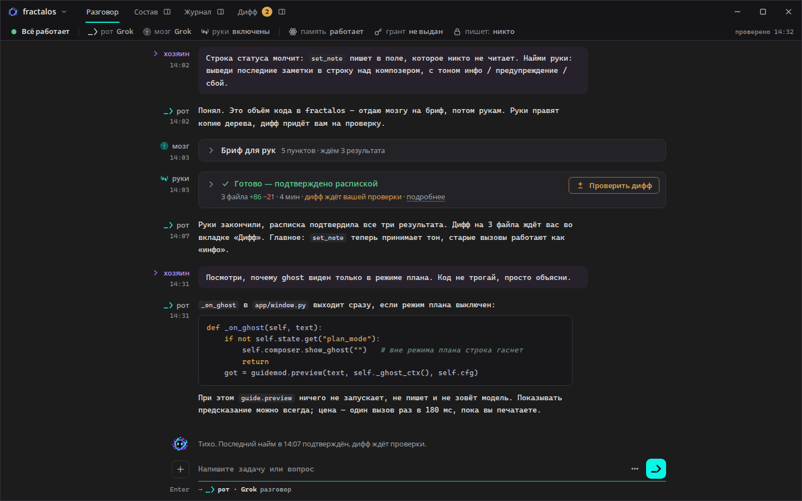

# Раунд 5 — композер без рамки

> **Задача** — от ведущего, по слову хозяина (`inbox/2026-09-25-03-kompozer.md`
> в ветке `local/ask-2026-09-25-03-kompozer`). Хозяин: «Мне нравится borderless
> композер как продолжение чата, как сейчас в fractal, но с точки зрения
> пропорций, функциональности и вёрстки есть вопросы».
>
> Сделан один вариант, доведённый до конца, и на отдельном снимке — одна
> альтернатива пропорций. Остальное окно (лента, заголовок, строка состояния) —
> из раунда 3–4, это фон снимков. Прототип — `rounds/05-composer/index.html`,
> открывается двойным щелчком. Дата: 2026-09-25.

## 1. Что сделано — коротко

| Вопрос хозяина | Как было в живом | Как стало |
|---|---|---|
| **Пропорции** | Поле от края окна до края, а лента — колонкой. | Поле стоит ровно под текстом ленты: та же колонка ≤ 1000 px, тот же гуттер 96 px и зазор 16 px. «+» — в гуттере под маскотом, там, где в ленте подписи ролей. Первая буква в поле и первая буква ответа рта — на одной вертикали, на 1440, на 1920 и с панелью «рядом». |
| **Функции** | `···`, «спросить», грант, «повторить найм» разбросаны по разным рядам; полоса гранта всегда скрыта; строка маршрута гаснет вне режима плана. | У каждой функции своё место (§3). Решения, которые ждут хозяина — грант и повтор найма, — стоят над полем, в строке активности. Опции — в «···», вложения — в «+», команды — по `/`. |
| **Вёрстка** | Строка маршрута отдельно под полем, длинный плейсхолдер, высоты «плывут». | Под полем одна строка 20 px: слева в гуттере клавиша (`Enter`), справа — куда уйдёт. Плейсхолдер — «Напишите задачу или вопрос». Высоты рядов постоянные, растёт только само поле: от 44 до 190 px. |

**Чем композер отделён от ленты — воздухом.** Рамки нет, тона подложки нет.
Над полем 12 px воздуха и строка активности с маскотом — она и есть шов. Поле
отмечено только своим подчёркиванием, как в живом окне. Линия шва (1 px `#34343B`
на ширину колонки) появляется, **только когда лента прокручена вверх**: тогда
она говорит «внизу ещё есть». Когда лента внизу, линии нет, и композер читается
как следующая строка разговора.

Почему воздух, а не линия или тон. Постоянная линия режет ленту и композер на
«окно чата» и «панель ввода» — ровно то, от чего хозяин ушёл, выбрав вид без
рамки. Тон подложки делает из композера ту же карточку, только без обводки. А
воздух и строка активности держат границу сами: маскот стоит в гуттере, где в
ленте стоят роли, так что ряд читается как ещё один «ход».

### Где без рамки тонко (прямо)

Без рамки ничего не ломается, но три вещи держатся на мелочах, и их нельзя
потерять при переносе:
1. **Подчёркивание поля** — единственная граница. Оно 1 px `#6A6A72`, контраст
   3,18 : 1, это только-только выше нормы 3 : 1 для границ элементов. Светлее
   фон или тоньше линия — и поле пропадёт.
2. **Шов при прокрутке.** Без линии, когда лента прокручена вверх, её последняя
   строка обрезается прямо над строкой активности, и кажется, что это конец
   разговора.
3. **Куда бросать файл.** Без рамки не видно цели. Принимает весь док, а при
   перетаскивании подчёркивание становится бирюзовым.

Если что-то из трёх не удастся в Qt, запасной ход — тон подложки `#1F1F23`
под полем. Не карточка, без обводки и без скруглений.

## 2. Снимки — все состояния

Каждое состояние снято в 1440×900 и 1920×1080, файлы — `shots/<имя>-<W>x<H>.png`.

| # | Состояние | Что видно | Адрес |
|---|---|---|---|
| 01 | **Пусто** | Поле без фокуса: серое подчёркивание, плейсхолдер. Под полем: `Enter → рот · Grok разговор`. | `#s=ok` |
| 02 | **Фокус** | Подчёркивание `#3AB8AF`, бирюзовая каретка. Больше ничего не меняется — ничего не прыгает. | `#s=ok&c=focus` |
| 03 | **Многострочный текст** | Поле выросло на 4 строки. «+» и кнопки прижаты к нижней строке. Над полем — вложение `status-mock.png` с «×». | `#s=ok&c=multi` |
| 04 | **Слэш-меню** | По `/` — все 35 команд по группам, над полем, шириной до 640 px. Внизу — «↑↓ выбрать · Tab дополнить · Enter выполнить · Esc закрыть». В строке маршрута: «выполнить /btw — рту не уходит». | `#s=ok&c=slash` |
| 05 | **Маршрут «мозг → руки»** | `найми: …` → `Enter → мозг → руки · найм: мозг пишет бриф, руки видят только его и правят копию дерева`. | `#s=ok&c=hire` |
| 06 | **Маршрут «отказ»** | Руки выключены: `Enter → отказ: руки выключены · включить — «руки» в строке состояния` красным. | `#s=degraded&c=focus` |
| 07 | **Занято — «Стоп»** | Рот отвечает. Отправка стала «Стоп» (золотая рамка, квадрат), `Esc`. Набранное: `Enter → в очередь · уйдёт рту, когда он закончит ответ`. В пустом поле строка скажет `Esc → остановить ответ рта`. | `#s=busy` |
| 08 | **Ждёт разрешения** | Над полем золотая полоса: «Руки просят запись C:\FractalOS\config.toml» · «Разрешить на 30 минут» · «На 8 часов…» · «Не разрешать». Карточка в ленте осталась записью (кто, куда, зачем) и указывает на полосу. | `#s=grant` |
| 09 | **Предложен «повторить найм»** | Найм не дошёл: над полем «Найм 3f9a1c2e не дошёл · прерван на этапе 2 из 4, расписки и диффа нет» и кнопка «Повторить найм». | `#s=retry` |
| 10 | **Рядом открыт Журнал** | Панель — половина окна. Колонка сузилась до 539 px (на 1920 — 779), поле по-прежнему под текстом. | `#s=ok&c=focus&side=journal` |
| 11 | **«···» — опции** | Думалка `low · medium · high · xhigh`, «Режим плана», «Enter — перенос строки», «Спросить о правилах памяти… рот не видит». | `#s=ok&c=opts` |
| 12 | **«+» — вложения** | «Прикрепить файл… Ctrl+O», «Вставить из буфера Ctrl+V», «Убрать вложения /drop», «Команды окна /». | `#s=ok&c=plus` |
| 13 | **Альтернатива пропорций** (только 1440) | Как в живом: «+» в начале строки, поле во всю колонку, от края гуттера. | `#s=ok&c=focus&a=1` |

Состояния без снимка есть в прототипе:
- `#c=btw` — вопрос в сторону;
- история `↑` в пустом поле: в строке маршрута — «история: 2 из 3 · ↓ новее»;
- `/multiline`: ключ в гуттере меняется на `Shift+Enter`;
- режим плана — «режим плана» справа в строке маршрута.

**Почему основной вариант, а не 13.** В альтернативе поле шире на 112 px, но
текст в поле начинается левее текста ленты. Глаз прыгает между «что сказали» и
«что я пишу», а «+» оказывается на месте подписей ролей только наполовину. В
основном варианте поле — продолжение колонки, а ширины 840 px хватает на 100
знаков моноширинным.

## 3. Было в живом → стало

Строка на каждую функцию из `functions.md`. Под таблицей — то, что есть в
`composer.py`, но не попало в перепись. Сигналы и их смысл не меняются, меняются
место и вид.

### 3.1. Сам композер

| Живое (`app/composer.py`) | Было | Стало | Где на экране |
|---|---|---|---|
| button `···` → `opt_requested` (`:265`) | Текстовая `···` справа от поля, меню строит окно | Кнопка 32×32 со значком `···`. Меню над ней: думалка (4 значения), режим плана, «Enter — перенос строки», «Спросить о правилах памяти…» | справа в ряду поля, перед отправкой |
| button `Разрешить на 30 минут` → `approve_choice("once")` (`:307`) | Полоса гранта **всегда скрыта**; решение — во всплывашке в ленте | Золотая кнопка в полосе решения над полем | строка активности, пока руки ждут |
| button `На 8 часов…` → `approve_choice("always")` (`:313`) | так же | Обычная кнопка. Спрашивает ещё раз, по умолчанию «Нет» — как сейчас | там же |
| button `нет` → `approve_choice("no")` (`:319`) | так же, надпись «нет» | Тихая кнопка «Не разрешать» — слово из DECISIONS 1.4 | там же |
| button `повторить найм` → `retry_requested` (`:284`) | Красная кнопка в ряду поля, справа от отправки | Кнопка «Повторить найм» в строке активности, рядом — почему: «Найм … не дошёл · прерван на этапе N из M». Показ — по тому же условию: работа не дошла | строка активности |
| button `спросить` → `teacher_ask_interest` (`:233`) | Строка «спросить» над отправкой, когда учитель включён | Пункт «Спросить о правилах памяти… рот не видит» в меню «···». Видимой кнопки нет: учитель — правило без лица (DECISIONS 0.10), а кнопка «спросить» делает из него собеседника. Когда учитель выключен, пункт неактивен | меню «···» |
| shortcut `Down` (`:100`) | Пустое поле → история вперёд; иначе — по слэш-меню | Так же. Плюс: `↓` продолжает шаг, пока в поле строка из истории (см. §6, п. 2) | поле |
| shortcut `Up` (`:100`) | Пустое поле → история назад; иначе — по слэш-меню | Так же. Место в истории видно справа в строке маршрута: «история: 2 из 3 · ↓ новее» | поле, строка маршрута |
| shortcut `Escape` (`:78`) | Закрыть слэш-меню, иначе — стоп хода | Так же. Порядок: открытое меню → «Стоп» ответа рта → «Стоп» работы рук | поле |
| shortcut `Tab` (`:82`) | Всегда дополняет, даже без меню: из поля нельзя уйти `Tab` | Дополняет, **только когда открыто слэш-меню**. Иначе `Tab` переводит фокус к «···» и отправке | поле |
| signal `field.textChanged` → `_on_text` (`:258`) | Рост поля, таймер маршрута, слэш-меню | Так же. Поле растёт от 44 до 190 px, дальше прокрутка | поле |
| signal `menu.itemClicked` → `_pick_item` (`:217`) | Подставить команду в поле | Так же: щелчок = `Tab` (дополнить), `Enter` = выполнить | слэш-меню |
| timer `180` → `_ghost_fire` (`:344`) | Маршрут пересчитывается через 180 мс после набора; строка **гаснет вне режима плана** (снимок `01-pusto`) | Тот же таймер 180 мс, но строка **видна всегда**: пустое поле тоже куда-то уходит | строка маршрута |

### 3.2. Что есть в `composer.py`, но не в переписи

| Живое | Было | Стало |
|---|---|---|
| `Enter` / `Shift+Enter`, `/multiline` (`Field.keyPressEvent`) | `Enter` шлёт, `Shift+Enter` — перенос; `/multiline` меняет местами | Так же. Когда `/multiline` включён, в гуттере под полем `Shift+Enter` вместо `Enter` — видно, чем отправлять |
| `set_enter_claim` — плейсхолдер говорит, кто ответит | «Напишите задачу · Enter — Grok · «найми …» — поручить исполнителю» | Плейсхолдер — «Напишите задачу или вопрос». Кто ответит — в строке маршрута, всегда. Подсказка кнопки отправки та же: «Отправить · Enter» |
| `set_turn_busy` — «Стоп» | Золотая рамка и знак стопа; подсказка «остановить ход · Esc» | Так же: 36×36, рамка 2 px `#E2A84A`. Строка маршрута говорит, что сделает `Enter` (в очередь), а в пустом поле — что сделает `Esc` |
| `send_is_stop=False` — занятый рот, но отправка | Кнопка остаётся отправкой, подсказка «в очереди · Enter» | Так же, и в строке маршрута золотом: «в очередь» |
| `files_pasted`, `dropEvent` — файлы в поле | Чипы `ChipRow` над полем | Чипы над полем: имя моноширинным, размер, «×» («убрать · на диске останется»). В «+» — «Прикрепить файл…», «Вставить из буфера», «Убрать вложения /drop». Перетаскивание — на весь док |
| `attach_clicked` («+») | Сразу открывает выбор файла | Открывает короткое меню (файл, буфер, убрать, команды). `Ctrl+O` — сразу выбор файла |
| `wheel_requested` — колесо над композером листает ленту | есть | Так же |
| `btw_requested` / `/btw` | Рамка BtwPane над доком | Так же. Строка маршрута для `/btw …`: «вопрос в сторону · ответ в рамке над полем · разговор не прерывается» |
| `process_dock`, `retain_*` | Док процесса скрыт; retain — по правому щелчку в нём | Композера не касается. Переносится как есть |
| `content_height` — постоянная высота | Ряды считаются всегда, чтобы не прыгал шов | Тот же принцип. Строка активности 46 px и строка маршрута 20 px есть всегда, меняется только высота поля. Всплывающие меню — поверх ленты, в раскладку не входят |

### 3.3. Слэш-команды (35)

Меню открывается по `/` над полем. Пока набран только `/`, команды разложены по
пяти группам. После первой буквы список плоский: сначала совпадения по началу,
потом по вхождению в имя или подсказку. Подсказки — **дословно из переписи**;
единственная правка — у `/always-approve`, она отмечена.

| Группа | Команда | Подсказка (как в живом) |
|---|---|---|
| Разговор | `/btw` | вопрос в сторону — основной разговор не прерывается |
| | `/plan` | режим плана — по желанию, не для каждого сообщения |
| | `/effort` | глубина размышлений: low\|medium\|high\|xhigh |
| | `/model` | сменить модель |
| | `/multiline` | Enter = перенос, Shift+Enter = отправить |
| | `/routes` | куда уходит сообщение |
| | `/copy` | скопировать ответ |
| | `/rewind` | остановить и откатить ленту окна |
| | `/context` | сколько контекста занято |
| | `/compact` | контекст / уведомление |
| | `/drop` | убрать прикреплённые файлы (на диске останутся) |
| Сессия | `/new` | новая сессия |
| | `/resume` | загрузить сессию |
| | `/rename` | название сессии |
| | `/history` | последний промпт в поле |
| | `/session-info` | статус сессии |
| | `/export` | сохранить разговор в markdown-файл |
| | `/delete` | убрать сессию в архив (с подтверждением) |
| Руки и грант | `/approve` | разрешить/запретить запись вне песочницы |
| | `/always-approve` | **было:** «ОПАСНО: запись без подтверждений до конца сессии» → **стало:** «без вопросов 8 часов — окно переспросит», золотом. Почему: по коду это `ALWAYS_MINUTES = 480`, а не «до конца сессии» (`docs/ANSWERS-R0.md` §2); слова — как у кнопки «На 8 часов…» (DECISIONS 1.4) |
| | `/diff` | дифф на проверку (Ctrl+4) |
| | `/usage` | контекст и расход исполнителя |
| | `/proof` | последний снимок метрик |
| Память | `/memory` | что помнит память |
| | `/remember` | записать в память |
| | `/why` | почему память дала эти подсказки |
| | `/pin-taken` | закрепить сработавшее правило |
| | `/teacher` | отвечает ли учитель памяти |
| Окно | `/how` | как устроено окно |
| | `/timestamps` | время у сообщений |
| | `/compact-mode` | плотная лента |
| | `/docs` | свежая документация библиотеки |
| | `/skills` | скиллы |
| | `/imagine` | картинка |
| | `/feedback` | оставить отзыв |

Группы — мои: в живом меню список плоский. Если группы мешают, их убирает одна
строка кода, а порядок внутри групп сохраняется.

## 4. Все числа

Цвета — токены раунда 3 (`rounds/03-clarity/index.html`, `:root`). Шрифты:
Cascadia Mono в поле, маршруте и командах; Segoe UI — в строке активности и
меню.

**Сетка.** Та же, что у ленты:
- колонка — не шире 1000 px, по центру, поля по 24 px;
- гуттер 96 px, зазор 16 px;
- по бокам дока ещё по 10 px — столько же лента оставляет под полосу прокрутки
  (`scrollbar-gutter: stable both-edges`). Без этого с панелью «рядом» поле
  уезжало на 10 px левее текста; в раунде 3 было так же.

| Ширина окна | Колонка текста (поле + «···» + отправка) | Само поле |
|---|---|---|
| 1440 | 840 px | 764 px |
| 1920 | 840 px | 764 px |
| 1440, «рядом» открыто | 539 px | 463 px |
| 1920, «рядом» открыто | 779 px | 703 px |

**Высоты (сверху вниз).** В покое док занимает 131 px. В раунде 3 было 193 px,
в живом окне — 86 px без маскота.

| Ряд | Высота | Состав |
|---|---|---|
| Отступ над доком | 6 px | + 6 px отступа маскота = 12 px воздуха |
| Строка активности | 46 px | маскот 34×34 (картинка 32) в гуттере, справа от гуттера — текст UI 13 px `#A8A8B0`, время моно 12 px `#8E8E97`, кнопка 30 px справа |
| Вложения (если есть) | 32 px | чип 26 px: рамка 1 px `#34343B`, радиус 6, моно 12 px `#E4E4E4`, размер `#8E8E97`, «×» 22×22; промежуток 6 px |
| Поле | 44…190 px | моно 14/22 px `#E4E4E4`, отступ 11 px сверху и снизу, фон прозрачный, каретка `#09F5E5` (в Qt — см. §5), плейсхолдер `#8E8E97`; после 190 px — прокрутка |
| Подчёркивание | 1 px | `#6A6A72`, в фокусе `#3AB8AF`; идёт на всю колонку текста, под «···» и отправкой тоже |
| Строка маршрута | 4 + 20 px | моно 12/20 px: клавиша в гуттере `#8E8E97` (прижата вправо), стрелка `#8E8E97`, адресат 600 `#E4E4E4`, пояснение `#A8A8B0`; отказ — `#EC8579`, очередь — `#E2A84A`; справа — история или «режим плана» `#8E8E97` |
| Отступ снизу | 10 px | |

**Кнопки ряда.** Все прижаты к нижней строке поля, между ними 4 px.

| Кнопка | Размер | Вид |
|---|---|---|
| «+» | 32×32 | в гуттере, прижата вправо, отступ снизу 6. Рамка 1 px `#34343B`, радиус 8, знак 16 px `#A8A8B0`; наведение и открытое меню — рамка `#6A6A72`, фон `#2B2B31`, знак `#E4E4E4` |
| «···» | 32×32 | без рамки, радиус 8, отступ снизу 6, значок `#A8A8B0`; наведение и открытое меню — фон `#2B2B31` |
| Отправка | 36×36 | радиус 9, отступ снизу 4, фон `#09F5E5`, глиф `_>` 20 px `#151517`, наведение `#5BFBF1` |
| «Стоп» | 36×36 | прозрачная, рамка 2 px `#E2A84A`, квадрат 14 px `#E2A84A`, наведение — фон `rgba(226,168,74,.08)` |

**Всплывающие** (слэш-меню, «+», «···»):
- окно: фон `#232327`, рамка 1 px `#6A6A72`, радиус 8, отступ 4, в 8 px над
  полем или над вложениями;
- слэш-меню:
  - ширина — по полю, но не больше 640 px; прижато к левому краю поля;
  - строка 30 px, радиус 6; колонки: команда 136 px, моно 13 px `#E4E4E4`;
    подсказка UI 13 px `#A8A8B0`;
  - выбранная строка: фон `#1F5353`, команда `#09F5E5`, подсказка `#E4E4E4`;
  - заголовок группы — 12 px `#8E8E97`;
  - список до 330 px (≈ 10 строк), дальше прокрутка;
  - подвал отделён линией `#34343B`, текст 12 px;
- меню «+» и «···»:
  - ширина 380 px; «+» прижато к левому краю «+», «···» — к правому краю «···»;
  - пункт 32 px, UI 13 px, значок 16 px `#A8A8B0`, пояснение `#A8A8B0`,
    клавиша моно 12 px `#8E8E97` справа;
  - флажок выключен — квадрат 12 px, рамка `#6A6A72`, радиус 3; включён — галка
    `#09F5E5`;
  - думалка — сегмент из 4 кнопок высотой 26 px в рамке `#34343B`; выбранная —
    фон `#1F5353`.

**Полоса решения** (грант):
- рамка 1 px `rgba(226,168,74,.6)`, фон `rgba(226,168,74,.08)`, радиус 8;
- отступы 5 / 6 / 5 / 12 px;
- ключ `#E2A84A`; «Руки просят запись» — 600 `#E4E4E4`; путь — моно 12 px
  `#A8A8B0`;
- кнопки 30 px: «Разрешить на 30 минут» — золотая рамка и текст; «На 8 часов…»
  — обычная; «Не разрешать» — тихая;
- на узкой панели кнопки переносятся на вторую строку.

**Повтор найма**:
- значок `#E06A5E`, «Найм … не дошёл» — `#EC8579`, пояснение `#A8A8B0`;
- кнопка «Повторить найм» — обычная, 30 px, со значком обновления.

**Движение**:
- подчёркивание и шов меняют цвет за 160 мс;
- больше анимаций в композере нет;
- маскот — как в раунде 3; выключается вместе с анимациями окна.

## 5. Qt: как собрать

| Элемент | Qt: как собрать |
|---|---|
| **Док** | `QWidget#composer` в той же колонке, что лента. Центрирование и предел 1000 px — тот же контейнер, что у ленты, чтобы обе колонки считались одной функцией. Внутри `QGridLayout`: столбец 0 — `setColumnMinimumWidth(0, 96)`, столбец 1 растягивается, `setHorizontalSpacing(16)`, `setVerticalSpacing(0)`. Ряды: 0 — активность, 1 — вложения, 2 — поле, 3 — маршрут. Поля `setContentsMargins(10+24, 6, 10+24, 10)`. Фон — `#1C1C1C`, без рамки. |
| **Шов** | `QFrame` высотой 1 px, `background:#34343B`, над доком на ширину колонки. `setVisible(bar.value() < bar.maximum())` по `valueChanged` и `rangeChanged` полосы прокрутки ленты. |
| **Строка активности** | Ряд 0: маскот `FractalMini` в столбце 0 (`Qt::AlignRight`), в столбце 1 — `QHBoxLayout` из `QLabel`-текста (`elidedText`), `QLabel` времени и `QPushButton` справа. Для гранта и повтора — тот же ряд, другой набор виджетов (`QStackedWidget` на три страницы: тихо/работа, грант, повтор). Высота страницы гранта — по `sizeHint`, перенос кнопок — `QBoxLayout` меняет направление в `resizeEvent` при ширине < 700. |
| **Полоса гранта** | `QFrame#askbar` с QSS `border:1px solid rgba(226,168,74,153); background:rgba(226,168,74,20); border-radius:8px`. Три `QPushButton`: `objectName` `approveonce`, `approvealways`, `approveno` — те же, что в живом, сигнал тот же `approve_choice("once" \| "always" \| "no")`. Показ — `show_approve(on, reason)` (сейчас это заглушка — нужно вернуть). |
| **Повтор найма** | `QPushButton#retryhire` с иконкой `refresh`, в странице «повтор» стека. Сигнал `retry_requested` не меняется. QSS как у обычной кнопки: рамка `#6A6A72`, текст `#E4E4E4`, 600. |
| **Вложения** | Существующий `ChipRow` в ряду 1, столбец 1. Чип — `QFrame` (рамка `#34343B`, радиус 6) + `QLabel` имени (моно 12) + `QLabel` размера + `QToolButton` «×». Скрыт, когда пусто (`setVisible(False)`, ряд схлопывается). |
| **«+»** | `QToolButton` 32×32 в столбце 0 ряда 2, `Qt::AlignRight \| Qt::AlignBottom`, `setPopupMode(InstantPopup)` + `QMenu` (4 пункта, разделитель). `Ctrl+O` — `QShortcut` сразу на выбор файла. |
| **Поле** | Существующий `Field(QPlainTextEdit)`. QSS: `background:transparent; border:none; padding:11px 0; font-family:"Cascadia Mono"; font-size:14px; selection-background-color:#1F5353`. Высота 22 px на строку: `QTextBlockFormat.setLineHeight(22, FixedHeight)` на весь документ. `fit_height()` — как сейчас, `FIELD_MIN=44`, `FIELD_MAX=190`, но считает `document().size().height()` (строки с переносом тоже), а не число блоков. Плейсхолдер — `setPlaceholderText`, цвет `#8E8E97` через `QPalette::PlaceholderText`. Каретка в Qt берёт цвет текста (`QPalette::Text`), то есть будет `#E4E4E4`; ширина — `setCursorWidth(2)`. Бирюзовая каретка из прототипа — только если рисовать её самому в `paintEvent`; это необязательно. |
| **Подчёркивание** | Рамку рисует не поле, а контейнер ряда: `QFrame#cf` (поле + «···» + отправка в `QHBoxLayout`, `spacing 4`, `Qt::AlignBottom`), QSS `QFrame#cf{border:none;border-bottom:1px solid #6A6A72}` и `QFrame#cf[focus="true"]{border-bottom-color:#3AB8AF}`. Свойство ставится по `focusInEvent`/`focusOutEvent` поля и при `dragEnterEvent` дока, затем `style().unpolish/polish`. |
| **«···»** | `QToolButton` 32×32, `autoRaise`, значок из трёх точек (`QPainter` или PNG). Сигнал `opt_requested` — окно строит `QMenu`. В меню: заголовок — `QWidgetAction` с `QLabel`; думалка — `QWidgetAction` с `QButtonGroup` из 4 `QToolButton(checkable)`; «Режим плана», «Enter — перенос строки» — `QAction(checkable)`; разделитель; «Спросить о правилах памяти…» — `QAction` → `teacher_ask_interest`, `setEnabled(teacher_on)`. |
| **Отправка / «Стоп»** | Существующий `GlyphButton("send", filled=True)` 36×36, `set_kind("stop")` при занятости — как сейчас. Стоп-QSS уже в коде (`border:2px solid #E2A84A; border-radius:9px`). |
| **Строка маршрута** | Ряд 3: столбец 0 — `QLabel#routekey` (моно 12, `#8E8E97`, `Qt::AlignRight`), текст «Enter» / «Shift+Enter» / «Esc». Столбец 1 — `QLabel#ghostroute` с `Qt::RichText` (стрелка, штамп роли ``, `<b>` адресата, пояснение) и `elidedText` по ширине; справа — второй `QLabel` для истории или «режим плана». `setFixedHeight(20)`, никогда не скрывается. Тон — свойство `tone` (`info`/`warn`/`fail`), как сейчас. |
| **Слэш-меню** | Сейчас это `QListWidget` внутри раскладки: он раздвигает док. Надо вынести поверх ленты: дочерний `QFrame` окна вне раскладки, `raise()`, геометрия вручную — левый край = левый край поля, низ = верх поля (или вложений) − 8. Внутри `QListView` + `QStandardItemModel`: заголовки групп — элементы без `ItemIsSelectable`, строка — делегат на две колонки (моно команда, UI подсказка). Высота до 330 px + подвал `QLabel`. Фокус не забирает (`Qt::NoFocus`) — стрелки и `Tab` из поля, как сейчас (`_nav_menu`, `_complete_menu`). |
| **История ↑↓** | Как сейчас (`history_requested` → окно → `put_history_text`). Второе условие для шага: в поле ровно текст текущей строки истории (`self._history_at`), иначе `↑` уходит в слэш-меню. Надпись «история: N из M · ↓ новее» — в правый `QLabel` строки маршрута. |
| **`Tab`** | В `Field.keyPressEvent`: `Tab` перехватывать, только если `menu.isVisible()`; иначе `super().keyPressEvent` при `setTabChangesFocus(True)`. |
| **Перетаскивание** | `dragEnterEvent` уже на доке; добавить свойство `focus="true"` на `#cf` на время перетаскивания и снять в `dragLeaveEvent`/`dropEvent`. |

## 6. Что нужно от окна (не ядра)

Всё ниже — код интерфейса, ядро не нужно.

1. **Маршрут — всегда.** Считать `guide.preview` при любом наборе, не только в
   режиме плана. На снимке живого окна строки под полем нет. Раунд 1 §5.3 это
   уже просил.
2. **История дальше одного шага.** По коду `composer.py` видно: после первого
   `↑` поле уже не пустое, и следующая `↑` уходит в `nav_requested`, то есть в
   слэш-меню. Похоже, по истории можно шагнуть только раз. Нужно условие «в
   поле ровно строка истории» (§5).
3. **Полоса гранта снова живая.** `show_approve` сейчас ничего не делает: полосу
   прячут, чтобы не прыгал шов. В новой раскладке полоса занимает место строки
   активности и шов не двигает. Нужен текст причины: кто просит и куда пишет.
4. **Занятость рта.** Строке маршрута нужно знать, что сделает `Enter` при
   занятом рте: очередь (`send_is_stop=False`) или вопрос в сторону (переполнение
   `btw`). Эти два пути уже различает окно — их надо передать в
   `show_ghost(label, tone)`.
5. **«Спросить» — пункт меню.** `teacher_ask_interest` вызывается из меню «···»,
   видимая строка `ask_row` больше не нужна.

## 7. Проверки

- **Детектор Impeccable:**
  `impeccable detect --json rounds/05-composer/index.html` → `[]`.
- **Щелчки и клавиши в браузере (Playwright)** — 28 проверок, все прошли:
  - по `/` открывается меню из 35 команд;
  - `/mu` находит `/multiline`, `Enter` выполняет, и ключ в гуттере становится
    `Shift+Enter`;
  - `Tab` дополняет команду, `Esc` закрывает меню;
  - `↑` дважды проходит по истории, место видно в строке маршрута, `↓` за
    последним очищает поле;
  - `найми: …` → «мозг → руки»; при выключенных руках — «отказ»;
  - поле растёт до 190 px, пустое — 44 px;
  - «+» → файл → чип → «×» убирает его;
  - в «···» думалка и режим плана переключаются, режим плана виден в маршруте,
    `Esc` закрывает меню;
  - «Стоп» снимает ход;
  - «Разрешить на 30 минут» убирает полосу;
  - «Повторить найм» запускает работу;
  - шов появляется при прокрутке ленты вверх;
  - `F1` работает;
  - ошибок в консоли нет.
- **Выравнивание (замер):** левый край поля совпадает с левым краем текста рта —
  x = 356 на 1440, 596 на 1920, 147 с панелью «рядом». «+» и маскот стоят по
  правому краю гуттера.
- **Контраст новых пар** (все тексты ≥ 4.5 : 1):
  - текст поля — 13.40;
  - плейсхолдер и клавиша в гуттере — 5.25;
  - маршрут — 7.22; отказ — 6.65; очередь — 8.06;
  - слэш-меню:
    - команда — 12.31, подсказка — 6.63, группа — 4.82;
    - выбранная строка: команда `#09F5E5` на `#1F5353` — 6.28, подсказка
      `#E4E4E4` на `#1F5353` — 6.82;
    - `/always-approve` золотом — 7.41;
  - полоса гранта: текст — 11.65, путь — 6.27, золотая кнопка — 7.00;
  - «Стоп» — 8.06;
  - глиф отправки — 13.20;
  - подчёркивание поля (граница, норма 3 : 1) — 3.18, в фокусе — 7.02.
- **Клавиатура и диктор:**
  - у поля `aria-describedby` указывает на строку маршрута, диктор читает, куда
    уйдёт `Enter`;
  - слэш-меню — `listbox` с `aria-activedescendant`, фокус остаётся в поле;
  - «+» и «···» — `aria-haspopup="menu"` и `aria-expanded`;
  - `Esc` закрывает меню и возвращает фокус на кнопку.
- **Финальная проверка Impeccable** — `⚠️ DEGRADED: в одном контексте`, без
  субагента (по правилам сессии). Приёмов из списка запретов нет, бирюза — только
  у отправки, фокуса и выбранной команды, золото — только у того, что ждёт
  хозяина.

## 8. Что изменилось в остальном окне (минимум)

- В заголовке нет кнопок «?» и «Команды» — это решение хозяина. `F1` и `Ctrl+K`
  работают.
- Карточка запроса гранта в ленте осталась записью (кто, куда, зачем), но
  кнопок в ней больше нет. Вместо них строка: «Решение — над полем ввода».
  Решение в одном месте: две одинаковые тройки кнопок на экране путают, а лента
  уезжает при прокрутке.
- Добавлены два сценария прототипа — «рот отвечает» (`s=busy`) и «найм не
  дошёл» (`s=retry`); они же есть в палитре `Ctrl+K`.
